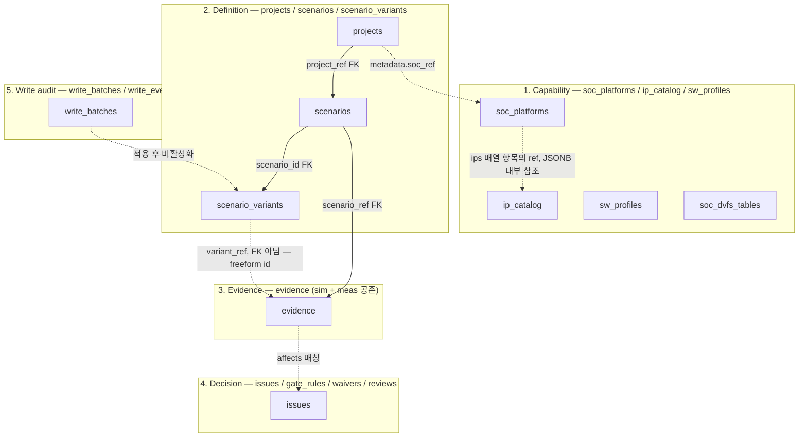
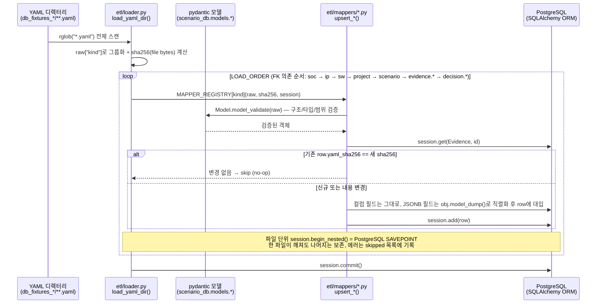
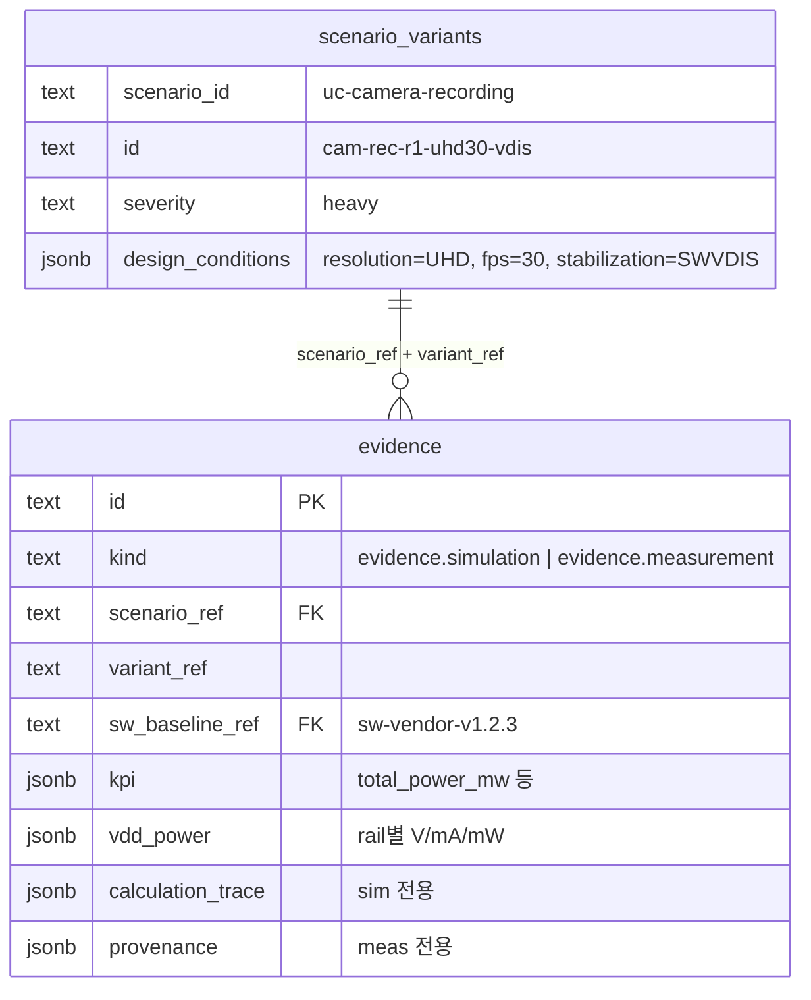
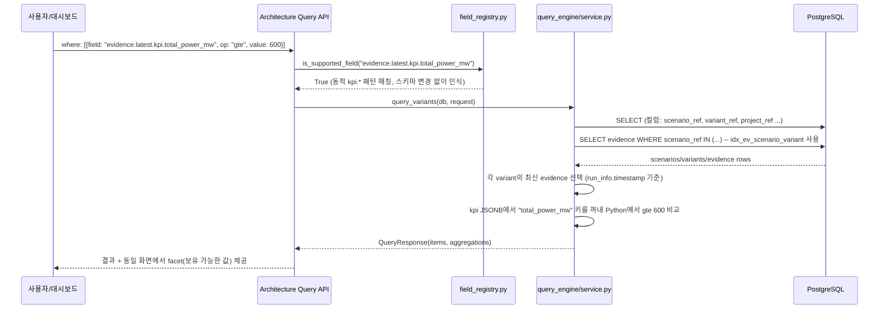

# PostgreSQL + JSONB 하이브리드 DB 설계 — Exynos2600 실측/시뮬레이션 예제

> 대상: ScenarioDB가 PostgreSQL 위에 어떤 원칙으로 테이블을 나누고, YAML 데이터가 실제로 어떻게 채워지며, "구조화 컬럼 + JSONB"의 하이브리드 구조가 어떤 확장성/질의 이점을 주는지 `Exynos2600 S26+` fixture의 카메라 녹화(UHD30+VDIS) 시나리오 — 시뮬레이션 evidence와 실측 evidence가 같은 테이블에 공존하는 실제 사례로 설명한다.
> 코드 기준: `src/scenario_db/db/models/*.py`, `src/scenario_db/etl/`, `src/scenario_db/query_engine/`, `db_fixtures_Exynos2600_S26Plus/`.

## 0. 한 줄 요약

ScenarioDB는 **"항상 조회/조인하는 필드는 컬럼, IP·칩·측정장비마다 모양이 달라지는 필드는 JSONB"** 라는 한 가지 기준으로 테이블을 나눈다. 그 결과 ① 새 IP, 새 측정 rail, 새 KPI가 추가될 때마다 스키마 마이그레이션을 하지 않고도 즉시 적재·질의가 가능하고, ② `scenario_ref + variant_ref` 라는 동일한 키 아래에서 **시뮬레이션 결과와 실측 결과가 한 테이블(`evidence`)에서 `kind` 컬럼으로만 구분되어 공존**하기 때문에 "시뮬레이션이 실측과 얼마나 가까운가"를 SQL 한 번으로 비교할 수 있다.

---

## 1. 왜 "순수 정규화 RDB"도, "순수 문서형 NoSQL"도 아닌가

| 기준 | 순수 정규화 RDB | 순수 문서형 NoSQL (예: MongoDB) | PostgreSQL + JSONB 하이브리드 (현재) |
|---|---|---|---|
| IP/칩마다 다른 capability 필드 수 | 컬럼 추가마다 `ALTER TABLE` 또는 EAV 안티패턴 필요 | 자유롭지만 FK/제약/조인이 약함 | JSONB 컬럼 안에서 자유, 그 외 키는 FK+제약 |
| `scenario_ref`, `variant_ref`, `kind` 같은 조인/필터 축 | 강함 (인덱스, FK 무결성) | 약함 (애플리케이션이 무결성 책임) | 강함 — 명시 컬럼 + FK + CHECK 제약 |
| 신규 측정 채널(rail, KPI, perfetto task) 추가 | 마이그레이션 필요 | 마이그레이션 불필요하지만 일관성 보장 없음 | **마이그레이션 불필요**, 동시에 SQL/연산자(`->>`, `@>`, GIN)로 질의 가능 |
| 트랜잭션/제약 (CHECK, UNIQUE, FK) | 강함 | 약함 | 강함 (PostgreSQL 엔진 그대로) |
| "자주 쓰는 JSONB 키를 나중에 컬럼으로 승격" | 해당 없음(이미 컬럼) | 불가능에 가까움 | **가능** — generated column으로 무중단 승격 (§7.3) |

SoC 시나리오 DB의 데이터는 이 표의 중간 지대에 정확히 들어맞는다: `scenario_ref`/`variant_ref`/`kind`/`measured_at` 같은 필드는 거의 모든 쿼리·조인의 축이라 RDB 컬럼이 맞고, `vdd_power`(rail 구성은 SoC마다 다름)·`design_conditions`(축이 시나리오마다 다름)·`calculation_trace`(시뮬레이터 내부 계산 단계)는 문서마다 모양이 달라 JSONB가 맞다.

---

## 2. 컬럼화 기준 (설계 원칙)

테이블을 설계할 때 필드 하나하나에 아래 4가지 기준을 적용한다.

| 기준 | 컬럼(명시 필드)로 둔다 | JSONB로 둔다 |
|---|---|---|
| FK/조인 필요 여부 | `scenario_ref`, `project_ref`, `soc_ref` 등 다른 테이블을 참조 | 외부 참조 없는 자유 구조 |
| `WHERE`/`ORDER BY`/`GROUP BY` 빈도 | 거의 모든 쿼리에 등장 (`kind`, `measured_at`, `overall_feasibility`) | 가끔, 또는 동적으로 결정되는 키 (`vdd_power.B5S4_VDDMIF_AP_L`) |
| 스키마 안정성 | 모든 row가 같은 의미·같은 타입 | row마다(IP마다, 칩마다, 측정장비마다) 모양이 다름 |
| 무결성 제약 필요 | CHECK/UNIQUE/NOT NULL이 의미 있음 (`kind in ('evidence.simulation','evidence.measurement')`) | pydantic 모델이 적재 시점에 이미 검증 — DB 레벨 제약은 불필요 |

이 기준을 가장 잘 보여주는 곳이 `evidence` 테이블이다.

---

## 3. 5-계층 스키마 개요



- **1번/2번 계층**이 먼저 채워져야 DB Explorer·Pipeline Viewer·Architecture Query가 의미 있는 값을 낸다 (`docs/db-data-guide.md` §1 참고).
- **3번 계층(`evidence`)**이 이번 문서의 핵심이다. 시뮬레이션과 실측이 **같은 테이블**에 들어간다.
- `scenario_variants.id`는 `evidence.variant_ref`로 참조되지만 FK가 아니라 freeform 텍스트다. variant는 routing_switch/buffer_overrides 같은 JSONB 패치를 부모 variant에 누적 적용하는 파생 구조(`derived_from_variant`)라 엄격한 FK보다 유연한 참조가 맞다.

---

## 3.5 실제 테이블 구조 — `psql \d+` 관점

"컬럼 vs JSONB"를 추상적으로 두지 않기 위해, ORM(`db/models/evidence.py`)과 마이그레이션(`alembic/versions/0001~0012`) 정의를 그대로 `psql`의 `\d+ evidence` 출력 형식으로 재구성하면 다음과 같다. (라이브 DB capture가 아니라 코드 정의를 그대로 옮긴 것이므로 컬럼명·타입·제약은 실제와 동일하다.)

```
                                        Table "public.evidence"
       Column        |           Type            | Collation | Nullable |                  Default
----------------------+----------------------------+-----------+----------+--------------------------------------------
 id                   | text                       |           | not null |
 schema_version       | text                       |           | not null |
 kind                 | text                       |           | not null |
 scenario_ref         | text                       |           | not null |
 variant_ref          | text                       |           | not null |
 project_ref          | text                       |           |          |
 measured_at          | timestamp with time zone   |           |          |
 derived_from         | jsonb                      |           |          |
 sw_baseline_ref      | text                       |           |          |
 sweep_job_id         | text                       |           |          |
 execution_context    | jsonb                      |           | not null |
 sweep_context        | jsonb                      |           |          |
 resolution_result    | jsonb                      |           |          |
 overall_feasibility  | text                       |           |          |
 aggregation          | jsonb                      |           | not null |
 kpi                  | jsonb                      |           | not null |
 run_info             | jsonb                      |           |          |   (sim only)
 ip_breakdown         | jsonb                      |           |          |   (sim only)
 dma_breakdown        | jsonb                      |           |          |   (sim only)
 timing_breakdown     | jsonb                      |           |          |   (sim only)
 dvfs_breakdown       | jsonb                      |           |          |   (sim only)
 timeline_events      | jsonb                      |           |          |
 external_devices     | jsonb                      |           |          |   (sim only)
 topology_order       | text[]                     |           |          |   (sim only)
 vdd_power            | jsonb                      |           |          |
 calculation_trace    | jsonb                      |           |          |   (sim debug only)
 params_hash          | text                       |           |          |
 provenance           | jsonb                      |           |          |   (meas only)
 cpu_breakdown        | jsonb                      |           |          |   (meas only)
 sw_task_timing       | jsonb                      |           |          |
 artifacts            | jsonb                      |           |          |
 yaml_sha256          | text                       |           | not null |
 sw_version_hint      | text                       |           |          | generated always as ((execution_context ->> 'sw_baseline_ref')) stored
 sweep_value_hint     | text                       |           |          | generated always as ((sweep_context ->> 'sweep_value')) stored
Indexes:
    "evidence_pkey" PRIMARY KEY, btree (id)
    "idx_ev_scenario_variant" btree (scenario_ref, variant_ref)
    "evidence_measured_at_idx" btree (measured_at)
    "evidence_params_hash_idx" btree (params_hash)
    "evidence_sw_version_hint_idx" btree (sw_version_hint)
Check constraints:
    "ck_evidence_kind" CHECK (kind IN ('evidence.simulation', 'evidence.measurement'))
Foreign-key constraints:
    "evidence_scenario_ref_fkey" FOREIGN KEY (scenario_ref) REFERENCES scenarios(id)
    "evidence_project_ref_fkey" FOREIGN KEY (project_ref) REFERENCES projects(id)
    "evidence_sw_baseline_ref_fkey" FOREIGN KEY (sw_baseline_ref) REFERENCES sw_profiles(id)
    "evidence_sweep_job_id_fkey" FOREIGN KEY (sweep_job_id) REFERENCES sweep_jobs(id)
```

`\d+`가 보여주는 결과는 결국 "타입이 고정된 33개 컬럼"이다. 그중 다수가 `jsonb`(또는 `jsonb` 배열)지만 PostgreSQL 입장에서는 그냥 컬럼 하나일 뿐이다 — 인덱스를 걸 수 있고, FK를 가질 수 있고, NOT NULL을 강제할 수 있다. **"JSONB를 쓴다"는 것은 "스키마가 없다"가 아니라 "이 컬럼의 내부 구조는 row마다 달라도 된다는 선언"**이다.

---

## 4. `evidence` 테이블 — 컬럼/JSONB 분리의 실제 사례

`src/scenario_db/db/models/evidence.py`의 `Evidence` 클래스를 컬럼 성격별로 나누면:

| 구분 | 필드 | 타입 | 비고 |
|---|---|---|---|
| **식별/조인 컬럼** | `id`, `scenario_ref`(FK), `project_ref`(FK), `sw_baseline_ref`(FK), `sweep_job_id`(FK) | Text | 모든 조회의 진입점 |
| **분기/필터 컬럼** | `kind` | Text + `CHECK (kind in ('evidence.simulation','evidence.measurement'))` | sim/meas를 같은 테이블에서 분리하는 유일한 컬럼 |
| **인덱스 컬럼** | `measured_at`, `params_hash` | DateTime / Text | `idx_ev_scenario_variant`, `params_hash`는 시뮬레이션 캐시 키 |
| **승격 컬럼** | `overall_feasibility` | Text | 원래 `resolution_result` JSONB 안에 있었지만 "쿼리 최적화"를 위해 컬럼으로 끌어올림 — 코드 주석 그대로 |
| **생성(generated) 컬럼** | `sw_version_hint`, `sweep_value_hint` | Text, `Computed("(execution_context->>'sw_baseline_ref')::text", persisted=True)` | JSONB 내부 키를 **PostgreSQL이 자동 동기화하는 컬럼**으로 승격 |
| **JSONB — sim 전용** | `run_info`, `ip_breakdown`, `dma_breakdown`, `timing_breakdown`, `dvfs_breakdown`, `calculation_trace`, `topology_order`(ARRAY) | JSONB | IP/DMA 구성마다 모양이 다름 |
| **JSONB — meas 전용** | `provenance`, `cpu_breakdown`, `sw_task_timing` | JSONB | 측정 장비/디바이스마다 모양이 다름 |
| **JSONB — sim+meas 공유** | `kpi`, `aggregation`, `vdd_power`, `timeline_events`, `artifacts`, `execution_context` | JSONB | 칩/시나리오마다 KPI 종류, rail 구성이 다름 |

핵심은 **"sim용 테이블, meas용 테이블을 따로 만들지 않았다"**는 점이다. 둘 다 `scenario_ref + variant_ref`로 묶이는 같은 개념(이 시나리오/조건에 대한 증거)이고, 차이는 JSONB 페이로드의 모양뿐이다. `kind` 컬럼 하나로 분기하면서, sim/meas 어느 쪽이든 같은 인덱스(`idx_ev_scenario_variant`)와 같은 FK 무결성을 공유한다.

---

## 5. 데이터 적재 흐름 (YAML → PostgreSQL)



이 흐름에서 하이브리드 구조가 주는 실질적 이득 두 가지:

1. **`yaml_sha256` 기반 멱등성** — 컬럼화된 `id` + `yaml_sha256`만 비교하면 바뀐 파일만 다시 쓴다. JSONB 필드가 몇 개든, 얼마나 깊든 비교 비용은 동일하다.
2. **파일 단위 SAVEPOINT** — 한 IP YAML의 JSONB 구조가 틀려도(예: 신규 필드 오타) 그 파일만 skip되고 나머지 수백 개 파일은 정상 적재된다. "전부 아니면 전무"가 아니라 부분 실패를 허용한다.

---

## 6. Worked Example — Exynos2600 카메라 녹화 UHD30 + VDIS

`db_fixtures_Exynos2600_S26Plus/`에서 시뮬레이션과 실측이 **동시에 존재**하는 실제 시나리오:

- `scenario_ref = uc-camera-recording` (`02_definition/uc-camera-recording.yaml`)
- `variant_ref = cam-rec-r1-uhd30-vdis` — UHD 30fps, rear 단일 센서, SW-VDIS 활성, severity `heavy`
- `03_evidence/sim-cam-rec-r1-uhd30-vdis-evt1-sw123-20260614.yaml` (`kind: evidence.simulation`)
- `03_evidence/meas-cam-rec-r1-uhd30-vdis-evt1-sw123-20260614.yaml` (`kind: evidence.measurement`)

### 6.1 두 evidence row가 같은 키로 묶이는 모습



같은 (`scenario_ref`, `variant_ref`, `sw_baseline_ref`) 조합에 대해 `id`만 다른 두 row(`sim-...`, `meas-...`)가 `kind`로 구분되어 존재한다 — **테이블도, 스키마도 늘리지 않고** "예측"과 "실측"을 나란히 둔 것이다.

### 6.2 같은 KPI를 비교 — 시뮬레이션 vs 실측

| 항목 | 시뮬레이션 (`kind=evidence.simulation`) | 실측 (`kind=evidence.measurement`) | 차이 |
|---|---|---|---|
| `kpi.total_power_mw` | **681.0698** (단일 계산값) | mean **675.222**, p95 **681.833**, std 5.80, n=3 | p95 기준 0.11%, mean 기준 0.87% 이내 |
| 데이터 성격 | `method: calculation`, 결정론적 1회 값 | `method: measurement`, 3회 반복의 통계(mean/p95/std/ci_95) | JSONB라서 "값 하나"와 "통계 분포"를 같은 `kpi` 컬럼에 자유롭게 담음 |
| 부가 페이로드 | `calculation_trace`(공식·중간값 추적), `ip_breakdown`/`dma_breakdown` | `provenance`(디바이스ID, 챔버온도, 수집툴 버전), `cpu_breakdown`(freq_residency), `sw_task_timing`(perfetto task) | sim/meas 각자 다른 JSONB 키를 쓰지만 같은 테이블 |

> 경영진 메시지로 쓰기 좋은 한 줄: *"이 시나리오에서 시뮬레이션 전력 예측(681.07mW)은 실측 p95(681.83mW)와 0.1% 이내로 일치 — 같은 DB 테이블에서 한 쿼리로 검증 가능."*

이 비교가 가능한 이유는 두 evidence가 **같은 컬럼 구조**(`scenario_ref`, `variant_ref`, `kpi`)를 공유하기 때문이다. 만약 sim/meas를 별도 테이블로 쪼갰다면 이런 비교 쿼리는 매번 `UNION`/조인 설계를 다시 해야 한다.

### 6.3 실제 row 데이터 — `psql \x` 확장 출력 관점

지금까지는 "어떤 데이터가 어디로 들어가는지"였다. 이번엔 같은 worked example이 실제로 DB에 **row로서** 어떻게 보이는지를 `psql`의 확장 출력(`\x`, `-[ RECORD 1 ]-` 형식)으로 그대로 옮긴다. 값은 모두 fixture YAML의 실제 값이고, 너무 긴 JSONB는 `…`로 줄였다.

**`projects` — `proj-sm-s947b`**
```
-[ RECORD 1 ]----+--------------------------------------------------------------------------
id               | proj-sm-s947b
schema_version   | 2.2
metadata         | {"name": "Exynos2600 Thetis S26 Plus", "soc_ref": "soc-exynos2600",
                 |  "board_type": "SM-S947B", "board_name": "S26 Plus",
                 |  "sensor_module_ref": "ip-sensor-rear-s5e9965",
                 |  "display_module_ref": "ip-display-panel-s5e9965",
                 |  "default_sw_profile_ref": "sw-vendor-v1.2.3"}
globals          | {"default_sw_profile_ref": "sw-vendor-v1.2.3", "tested_sw_profiles": []}
yaml_sha256      | <sha256 of proj-sm-s947b.yaml>
```

**`soc_platforms` — `soc-exynos2600`**
```
-[ RECORD 1 ]------+------------------------------------------------------------------------
id                 | soc-exynos2600
schema_version     | 2.2
process_node       | 3nm
memory_type        | LPDDR5X
bus_protocol       | AMBA/AXI
compression_modes  | {"COMP_BAYER_LOSSLESS": {"compressor": "SBWC", "comp_ratio": 1.0},
                    |  "COMP_BAYER_LOSSY": {"compressor": "SBWC", "comp_ratio": 0.5},
                    |  "COMP_YUV_LOSSLESS": {"compressor": "SBWC", "comp_ratio": 1.0},
                    |  "COMP_YUV_LOSSY": {"compressor": "SBWC", "comp_ratio": 0.5}}
ips                 | [{"ref": "ip-sensor-rear-s5e9965", "instance_count": 1}, … 총 13개 IP]
```

**`scenario_variants` — `cam-rec-r1-uhd30-vdis`** (parent: `uc-camera-recording`)
```
-[ RECORD 1 ]---------------+--------------------------------------------------------------
scenario_id                 | uc-camera-recording
id                          | cam-rec-r1-uhd30-vdis
severity                    | heavy
design_conditions           | {"subscenario": "UHD_VIDEO", "dvfs_sn": "IS_DVFS_SN_REAR_SINGLE_VIDEO_UHD30",
                             |  "sensor_place": "rear", "resolution": "UHD", "fps": 30,
                             |  "is_scenario": "IS_SCENARIO_SWVDIS", "stabilization": "SWVDIS",
                             |  "dpu_layer_count": 3}
routing_switch               | {"disabled_nodes": ["sensor_rear2", "sensor_rear3", "sensor_front", "npu"],
                              |  "disabled_edges": [… 6개 edge]}
topology_patch                | (null)
buffer_overrides              | (null)
ip_requirements                | (null)
sw_requirements                 | (null)
violation_policy                 | (null)
derived_from_variant              | (null)
```
> 이 variant는 `derived_from_variant`가 비어 있는 루트 variant다. 다른 variant들은 여기에 부모 variant id를 채워 `routing_switch`/`buffer_overrides`를 패치 형태로 누적한다 — 컬럼 구조를 바꾸지 않고도 "변형의 변형"을 표현하는 방식이다.

**`evidence` — 시뮬레이션 row** (`kind = 'evidence.simulation'`)
```
-[ RECORD 1 ]------+-------------------------------------------------------------------------
id                 | sim-cam-rec-r1-uhd30-vdis-evt1-sw123-20260614
kind               | evidence.simulation
scenario_ref       | uc-camera-recording
variant_ref        | cam-rec-r1-uhd30-vdis
project_ref        | proj-sm-s947b
measured_at        | (null)                      <- sim에는 측정 시각이 없다
sw_baseline_ref    | sw-vendor-v1.2.3
execution_context  | {"silicon_rev": "EVT1", "sw_baseline_ref": "sw-vendor-v1.2.3",
                    |  "thermal": "room", "ambient_temp_c": 25.0,
                    |  "power_state": "discharging", "method": "calculation"}
aggregation        | {"strategy": "single_run"}
kpi                | {"total_power_mw": 681.0697728, "total_power_ma": 200.3146390588,
                    |  "core_power_mw": 183.4057728, "bw_power_mw": 497.664,
                    |  "total_bw_mbs": 6220.8, "hw_time_max_ms": 29.75,
                    |  "critical_path_ms": 412.9044206667, "critical_path_task_count": 15}
run_info           | {"timestamp": "2026-06-14T15:30:00+09:00", "tool": "scenariodb-sim",
                    |  "tool_version": "0.1.0", "source": "calculated"}
vdd_power          | {}                        <- 이 fixture는 rail별 분해 없이 합산 KPI만 계산
cpu_breakdown      | (null)                    <- meas only 컬럼, sim에서는 비어 있음
provenance         | (null)                    <- meas only 컬럼
calculation_trace  | {"config": {"vbat": 4.0, "pmic_efficiency": 0.85}, "kpi": {…}, "warnings": []}
sw_version_hint (generated) | sw-vendor-v1.2.3   <- execution_context->>'sw_baseline_ref'에서 자동 생성
yaml_sha256        | <sha256 of sim-*.yaml>
```

**`evidence` — 실측 row** (`kind = 'evidence.measurement'`, 같은 테이블·같은 PK 네임스페이스)
```
-[ RECORD 1 ]------+-------------------------------------------------------------------------
id                 | meas-cam-rec-r1-uhd30-vdis-evt1-sw123-20260614
kind               | evidence.measurement
scenario_ref       | uc-camera-recording
variant_ref        | cam-rec-r1-uhd30-vdis
project_ref        | proj-sm-s947b
measured_at        | 2026-06-14 15:30:00+09
sw_baseline_ref    | sw-vendor-v1.2.3
execution_context  | {"silicon_rev": "EVT1", "sw_baseline_ref": "sw-vendor-v1.2.3", …, "method": "measurement"}
aggregation        | {"strategy": "mean_over_runs"}
kpi                | {"total_power_mw": {"mean": 675.222, "p95": 681.833, "std": 5.803,
                    |   "ci_95": [668.656, 681.789], "n": 3},
                    |  "frame_latency_ms": {"mean": 28.4, "p95": 32.1, "n": 5400},
                    |  "fps_effective": 29.97}
vdd_power          | {"B5S4_VDDMIF_AP_L": {"voltage_v": 0.5687, "current_ma": 70.4,
                    |   "power_mw": 42.74, "std_mw": 0.367, "domain": "MIF"}, … 총 17개 rail}
cpu_breakdown      | [{"cluster": "BIG", …}, {"cluster": "MID", …}, {"cluster": "LIT", …}]
sw_task_timing     | [{"task": "eis_warp", …}, {"task": "hal_request_thread", …},
                    |  {"task": "encoder_input_feed", …}]
provenance         | {"device_id": "EVT1-ERD-SN-0042", "chamber_controlled": true,
                    |  "chamber_temp_c": 25.0, "build_id": "UP1A.260601.001",
                    |  "collection_method": "power_monitor", "sample_count": 3,
                    |  "duration_per_sample_s": 30.0, "confidence_level": 0.95}
timeline_events    | [{"type": "frame_drop", "t_ms": 84210.0, "count": 1},
                    |  {"type": "thermal_step", "t_ms": 152000.0, "detail": "skin 39C, no throttle"}]
calculation_trace  | (null)                  <- sim only 컬럼
run_info           | (null)                  <- sim only 컬럼
sw_version_hint (generated) | sw-vendor-v1.2.3
yaml_sha256        | <sha256 of meas-*.yaml>
```

**같은 테이블, 다른 모양 — 한눈에 대조**

| 컬럼 | sim row | meas row |
|---|---|---|
| `measured_at` | `(null)` | `2026-06-14 15:30:00+09` |
| `vdd_power` (rail 분해) | `{}` (0개) | 17개 rail |
| `cpu_breakdown` | `(null)` | 3개 cluster |
| `provenance` (측정 신뢰도) | `(null)` | device/chamber/sample 메타 |
| `calculation_trace` | 공식·warning 기록 | `(null)` |
| `kpi.total_power_mw` 형태 | 스칼라 `681.07` | `{mean, p95, std, ci_95, n}` 객체 |

→ 두 row는 **컬럼 목록이 완전히 동일**하지만 값이 들어차는 컬럼이 다르고, 같은 `kpi` 컬럼 안에서도 JSON 구조 자체가 다르다(스칼라 vs 통계 객체). RDB라면 이 차이를 감당하려고 `evidence_simulation`/`evidence_measurement` 두 테이블을 만들거나 `kpi_total_power_mw_mean`/`kpi_total_power_mw_p95`/`kpi_total_power_mw_scalar` 같은 컬럼을 미리 다 만들어둬야 했을 것이다. 여기서는 컬럼 스키마를 한 번도 바꾸지 않고 그 차이를 표현한다.

---

### 6.4 실측 JSONB 내부의 "측정 신뢰도" 메타데이터

실측 evidence는 단순 숫자가 아니라 **신뢰도 메타데이터**를 함께 들고 있다 — 이것도 JSONB의 자유도가 주는 이득이다:

```yaml
provenance:
  device_id: EVT1-ERD-SN-0042
  chamber_controlled: true
  collection_tool_versions: { power_monitor: pm-tool-v3.1 }
  sample_count: 3
  confidence_level: 0.95
kpi:
  total_power_mw: { mean: 675.222, p95: 681.833, std: 5.803, ci_95: [668.656, 681.789], n: 3 }
```

`confidence_level`, `ci_95`, `sample_count` 같은 필드는 측정 방법론에 따라 있을 수도 없을 수도 있다. 고정 컬럼이었다면 "측정 신뢰도 스키마"를 미리 다 정의해야 했겠지만, JSONB라서 측정 방법이 바뀌어도(예: 샘플 수 5회로 변경, 새 신뢰구간 방식 도입) **즉시 반영**된다.

---

## 7. 하이브리드의 확장성 — 실제 사례 4가지

### 7.1 신규 측정 rail 추가 — 마이그레이션 0건

`vdd_power`는 JSONB이므로 새 PMIC rail이 추가되면 YAML에 키 하나를 더 쓰고 재적재만 하면 된다.

```diff
 vdd_power:
   B5S4_VDDMIF_AP_L: {voltage_v: 0.5687, current_ma: 70.4, power_mw: 42.74, domain: MIF}
+  B7S1_VDD_NEW_RAIL_L: {voltage_v: 0.75, current_ma: 12.3, power_mw: 9.23, domain: ISP}
```

`ALTER TABLE`도, ORM 모델 변경도, 코드 배포도 필요 없다. (실제로 위 예시 fixture에는 17개 rail이 있는데 SoC/보드마다 rail 개수와 이름이 전부 다르다 — 고정 컬럼이었다면 보드마다 다른 테이블이 필요했을 것이다.)

### 7.2 신규 KPI 추가 — Query Engine까지 자동 반영

`kpi` JSONB에 새 키(예: `thermal_margin_c`)를 추가하면, Architecture Query의 **동적 필드 레지스트리**(`query_engine/field_registry.py`)가 `evidence.latest.kpi.thermal_margin_c`라는 질의 가능 필드를 코드 수정 없이 즉시 노출한다:

```python
# field_registry.py — 정적으로 등록된 필드 목록에 없어도
# "evidence.latest.kpi.<무엇이든>" 패턴은 자동으로 number 필드로 인식됨
if field.startswith("evidence.latest.kpi."):
    return _valid_dynamic_suffix(field.removeprefix("evidence.latest.kpi."))
```

같은 방식으로 `design_conditions`의 새 축(`axis.<key>`)도 자동 인식된다. **새로운 측정/시뮬레이션 차원을 추가할 때 스키마 변경과 API 코드 변경이 모두 불필요**하다는 것이 이 구조의 핵심 이점이다.

### 7.3 "필요해지면 그때 컬럼으로 승격" — generated column

`overall_feasibility`, `sw_version_hint`, `sweep_value_hint`는 원래 JSONB(`resolution_result`, `execution_context`, `sweep_context`) 안에 있던 값인데, **쿼리 빈도가 높아지자 나중에 컬럼으로 승격**했다:

```python
sw_version_hint = Column(
    Text,
    Computed("(execution_context->>'sw_baseline_ref')::text", persisted=True),
    index=True,
)
```

PostgreSQL이 `execution_context` JSONB가 바뀔 때마다 이 컬럼을 자동으로 재계산해 채우므로, 애플리케이션 코드는 한 줄도 바꾸지 않고 "JSONB 안의 값"을 "인덱스가 걸린 컬럼"으로 그대로 승격할 수 있다. **처음부터 모든 걸 컬럼화하지 않고, 실제로 자주 필터링되는 키만 나중에 승격하는 전략**이 가능한 것이 RDB+JSONB 하이브리드의 장점이다.

### 7.4 JSONB 전용 인덱스 — GIN / 표현식 인덱스

이미 운영 중인 실제 인덱스 두 가지(`alembic/versions/0001_initial_schema.py`):

```sql
-- ① GIN 인덱스: feature_flags JSONB 전체에 대해 "키 존재/값 포함" 질의를 가속
CREATE INDEX idx_sw_prof_features ON sw_profiles USING gin (feature_flags);

-- ② 표현식 인덱스: JSONB 안의 특정 키 하나만 골라 B-tree 인덱싱
CREATE INDEX idx_sw_prof_family ON sw_profiles ((metadata->>'baseline_family'));
```

①은 "이 SW profile이 feature X를 켰는가" 같은 JSONB 포함 질의(`feature_flags @> '{"x": true}'`)를 인덱스 스캔으로 처리하고, ②는 자주 필터링되는 JSONB 키 하나만 골라 일반 컬럼과 동일한 속도의 인덱스를 만든다 — **컬럼을 늘리지 않고도 컬럼 수준의 질의 성능**을 얻는 방법이다.

---

## 8. 하이브리드의 질의성 — Architecture Query 흐름



여기서 중요한 것은 **컬럼 부분(`scenario_ref`/`variant_ref`/`project_ref`)은 PostgreSQL이 인덱스로 좁히고, JSONB 부분(`kpi.*`, `design_conditions.*`)은 애플리케이션이 동적으로 해석**한다는 점이다. 그 결과:

- `project.soc_ref`, `scenario.category`, `variant.severity` 같은 **고정 필드**는 빠른 인덱스 스캔 (`Project.metadata_["soc_ref"].astext.in_(soc_scope)` 같은 JSONB 연산자도 SQL 단계에서 직접 사용 — `service.py:_load_scoped_projects`).
- `axis.<임의 design_conditions 키>`, `evidence.latest.kpi.<임의 KPI 키>` 같은 **가변 필드**는 새 키가 추가될 때마다 코드를 고치지 않고도 질의 화면(facet)에 자동으로 나타난다.

즉, "구조가 고정된 80%는 RDB의 견고함으로, 구조가 가변적인 20%는 JSONB의 유연함으로" 처리하는 것이 질의 계층까지 일관되게 이어진다.

---

## 9. 결론 — "고정 스키마 RDB였다면" 시나리오별 비교

| 변경 상황 | 고정 스키마 RDB였다면 | 현재 하이브리드 구조 |
|---|---|---|
| 신규 SoC 추가 (rail 구성 다름) | rail마다 컬럼 추가 또는 보드별 테이블 분기 | YAML 한 파일 추가, 적재만 |
| 새 PMIC rail 측정 추가 | `ALTER TABLE` + 배포 | `vdd_power` JSONB에 키 추가 |
| 새 KPI(예: thermal_margin) 추가 | 컬럼 추가 + Query API 코드 수정 | `kpi` JSONB에 키 추가 — Query API 자동 인식 |
| 자주 쓰는 JSONB 키를 빠르게 만들고 싶을 때 | 처음부터 컬럼이라 선택지 없음 | generated column으로 무중단 승격 |
| 시뮬레이션 vs 실측 비교 | 별도 테이블이면 매번 UNION/조인 재설계 | 같은 테이블, `kind`로만 분기 — 비교 쿼리 즉시 가능 |

ScenarioDB의 PostgreSQL+JSONB 하이브리드는 "유연하니까 아무거나 JSONB에 넣자"가 아니라, **조인/제약이 필요한 80%는 컬럼+FK+CHECK로 단단하게, IP·칩·측정장비마다 모양이 달라지는 20%는 JSONB로 열어두고 필요하면 나중에 컬럼으로 승격**하는 명확한 기준을 따른다. Exynos2600 카메라 녹화 시나리오에서 시뮬레이션과 실측 evidence가 같은 테이블·같은 키로 공존하며 한 쿼리로 비교되는 것이 그 기준이 실제로 작동한다는 증거다.
