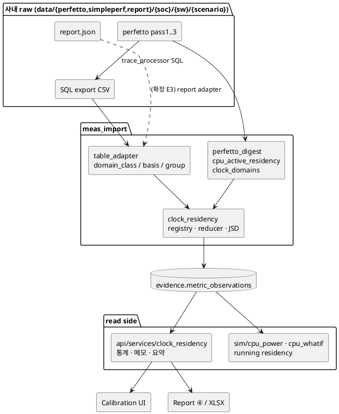

# Clock residency · raw data · CPU 모델 확장 설계 (사내 적용용)

이 문서는 사외(Exynos2600 fixture)에서 구현한 **clock 분포(residency)** 기능의 구조와, 사내에서 실측 data를 붙이면서
추가할 확장(raw data 관리, 조합 탐색 CPU 모델, 3-pass PMU, GPU 모델)의 설계를 정리한다.
사용법은 [Clock 분포 import 가이드](../guides/measurement/clock-residency-import-ko.md) 참고.

## 1. 1차 구현 범위 (clock residency, 완료)

| 영역 | 내용 | 파일 |
|---|---|---|
| Import | CPU cluster running(idle 제외) residency, DSU, GPU freq/gating, PMU pass별 `group` + JSD 품질 지표 | `meas_import/clock_residency.py`, `table_adapter.py`, `pmu_digest.py` |
| Perfetto | `cpu_active_residency` (cpufreq × cpuidle `SPAN_JOIN`), `clock_domains` (임의 counter track + utilization track) | `meas_import/perfetto_digest.py`, `meta.py` |
| Catalog | `cpu.freq_residency_active`, `gpu.*`, `clock.residency_pass_jsd` | `models/evidence/metric_catalog.yaml` |
| CPU 모델 | running residency가 있으면 dynamic energy/cycle을 cycle 가중 running 분포로, stall 환산 f0도 running 평균으로. 없으면 기존과 동일 | `sim/cpu_power.py`, `cpu_whatif.py`, `cpu_profile.py`, `models.py` |
| 해석 규칙 | domain별 통계 + 메모(`pass_divergence`, `high_opp`, `burst`, `idle_gap`, `idle_domain`), 요약 문장 — UI·보고서 공용 | `api/services/clock_residency.py` |
| API | `GET /calibration/measurements/{id}` → `clock_residency`, `GET /calibration/clock-residency?scenario_id=` | `api/routers/calibration.py`, `api/services/calibration.py` |
| UI | Calibration 상세 “Clock 분포” 카드, 측정별 비교 heat table, CPU what-if “측정 분포 vs 모델” | `ui/src/components/ClockResidency.tsx` |
| 보고서 | ④ 실측 대조 아래 “Clock 분포 실측” 표, XLSX `Clock 분포` sheet (snapshot key `clock_residency`) | `reporting/clock_section.py` |
| Fixture | E2600 SYNTHETIC 2건 (`meas-synthetic-clock-residency-{r1-uhd30-vdis,r1-8k30-psm}-e2600-evt1`) | `scripts/generate_clock_residency_example.py`, `examples/measurement-import/clock-residency-e2600/` |

## 2. 사내 적용 절차 (실측 과제)

1. trace_processor로 pass별 CSV export (`SQL_FREQ_RESIDENCY`, `SQL_CPU_ACTIVE_RESIDENCY`, GPU/DSU는 `sql_counter_residency([...])`) 또는 `perfetto:` section으로 trace 직접 digest.
2. `select name from counter_track`로 GPU · DSU freq track 이름 확인 → `clock_domains.tracks`.
3. meta.yaml: E2600 예시(`examples/measurement-import/clock-residency-e2600/*/meta.yaml`)를 복사해 `cpu_map`, 파일 이름, `filter`, `states` regex만 사내 형식으로 수정.
4. `uv run python -m scenario_db.meas_import.cli --meta <meta.yaml> --out <db folder> --strict` → report warning 확인 (`JSD > 0.05`, 미매핑 state/cpu).
5. ETL → `#/calibration`에서 해당 측정 선택 → Clock 분포 카드 확인. fmax가 비면 `power_model_params.cpu` / IP catalog `capabilities.dvfs_model.max_freq_khz` 확인.

같은 domain을 PMU table과 perfetto trace가 둘 다 주면 PMU table 값만 사용한다(bin 혼합 방지).

## 3. 확장 설계 (사내 추가 시)

### E1. 새 clock domain (NPU, MIF, …)
- `DOMAIN_CLASSES`에 1줄 + catalog metric 추가. import · view · UI · report는 registry를 따라감.
- MIF처럼 DVFS가 BW와 결합된 domain은 `mif` class로 넣고, 기존 `bandwidth.*` observation과 같은 capture에서 비교.

### E2. Raw data manifest (R0)
목적: `data/perfetto|simpleperf|report/{soc}/{sw}/{scenario}` 세 tree를 **하나의 capture**로 묶고, extractor 버전이 바뀌면 재추출 대상을 찾는다.

| 항목 | 설계 |
|---|---|
| 위치 | scenario 디렉토리마다 `capture.yaml` (raw tree에, repo 밖) |
| 필드 | `capture_id`, `soc`, `sw_version`, `scenario_ref`, `variant_ref`, `conditions`(thermal · governor · 시작 온도), `purpose`(profile/power), `artifacts[]`(kind, pass, rel_path, sha256, bytes, pmu_events) |
| 경로 | `RAW_ROOT` 환경변수 기준 상대 경로 (사외 fixture는 `examples/raw/`) |
| DB | 신규 table `raw_capture`, `raw_artifact`, `derived_artifact(extractor, extractor_ver, uri)` — **새 alembic revision 1개**, 기존 table 변경 없음 |
| evidence 연결 | meta.yaml `capture_ref` 1줄 → provenance에 기록, `artifacts[]`는 manifest에서 자동 생성 |
| stale | `extractor_ver` < 코드 버전이면 model-status 바에 “재추출 필요” (sim evidence params_hash와 같은 방식) |
| 보존 | perfetto/perf.data는 현·직전 SW version만 hot, folded stack top-N과 L1 parquet은 영구 |

구현 위치 제안: `meas_import/capture_manifest.py`(신규), `db/models/raw.py`(신규), `alembic/versions/00xx_raw_capture.py`(신규). 기존 파일 수정은 `meta.py`(`capture_ref` 필드)와 `cli.py`(manifest 해석) 정도.

### E3. report.json adapter
- report.json(IP BW · latency · IP clock · cluster clock 분포)을 `pmu_digest` neutral row로 펼치는 설정 기반 adapter (`table_adapter`와 같은 방식, JSON path → metric/scope 매핑).
- cluster clock 분포 → `cpu_freq_time` sample (`group: report`), IP clock 분포 → 기존 `ip_clock_residency`.
- perfetto와 report가 같은 cluster를 주면 perfetto를 canonical로, report는 JSD 비교용 group으로만 사용.

### E4. 조합 탐색 CPU 항 (C1, opt-in) — **구현됨**
- `TimingBudgetOptions.cpu_model: "flat" | "profile"` (기본 `flat` = 현행), `cpu_profile_ref`, `cpu_bw_source`, `cpu_bw_scale`.
- `profile`: service(`api/services/cpu.with_cpu_profile`)가 `cpu_profile_ref` 또는 variant의 최신 측정 profile(실측 우선)을 붙이고,
  `sim/cpu_scenario.apply_profile_cpu`가 측정 배치 × SW 증가(`runtime_scale`)를 EAS + schedutil로 재현 → cluster OPP·leakage·DSU 포함
  `cpu_mw`. 기존 값은 `cpu_mw_flat`으로 남고 `power.cpu_profile`에 근거(OPP, profile id, BW 출처)를 기록.
- profile 또는 CPU topology(`power_model_params.cpu`)가 없으면 flat 유지 + `cpu_profile.note`.
- UI: Timing Budget “CPU 모델: 가정 / 측정 profile”(`#/timing?...&cpu=profile`), 조합 탐색 “CPU: 측정 profile (EAS)”. slice에 `cpu_basis`.
- 예 (E2600 f1-uhd60, simcfg v2): 가정 92 mW → profile 453 mW (×1.0), 578 mW (×1.3) — 가정 모델이 CPU를 크게 과소평가.

### E5. CPU BW 실측 (C2) — **구현됨**
- `cpu_model: profile` + `cpu_bw_source: measured`(기본): `cpu.bus_bytes_pf` × growth × fps × `cpu_bw_scale` → `bw.sw_mbs`.
  BW 전력 = 측정 MB/s × BW 모델의 mW/MBps(CPU DMA가 없으면 HW 평균). 모델 값은 `sw_mbs_model`, `bw_sw_mw_model`.
- 모델 SW DMA node 이름은 유지(측정 총량으로 비례 조정) → compression delta 계산 키가 깨지지 않음.

### E6. PMU 3-pass counter 정합 — **구현됨**
- `counters` source에 `group`(pass) 허용 → `meas_import/pmu_passes.py`가 합산 대신 병합:
  anchor(`cycles`, `instructions`) = pass 평균, 그 외 counter = 측정 pass의 instruction당 비율 × 병합 instructions, thread cycles = 평균.
- 품질: task별 / capture 전체 anchor CV → `cpu.pass_cv` (scope `task`, `capture`), 5% 초과(cycle 비중 1% 이상 task)면 import 경고,
  Calibration Clock 카드 요약에 표시.
- `pmu.window`는 **pass 하나**의 frame 수/시간.

### E7. GPU power — **구현됨 (SAMPLE 계수)**
- `sim/domain_power.py`: IP catalog `capabilities.power_model`의 `dynamic_coeff_uw_per_mhz_v2`(없으면 driver `profiler_dynamic_coeff`),
  `vf_table`(없으면 `vf_table_sample`), `leakage`(없으면 `leakage_sample`).
  dynamic = 동작 비율 × Σ running 분포 × coeff·f·V², static = (1 − power gated) × Σ 전체 분포 × leak(V).
- 같은 측정의 rail(이름에 `G3D|GPU`) 합과 비교 (`measured_mw`, `delta_pct`). Calibration Clock 카드 “추정 mW” 열, 보고서 · XLSX.
- E2600 `ip-gpu-s5e9965`에 SAMPLE V-f / leakage 추가 (ECT/ASV 미확보 → SAMPLE 표시). profiler 계수 scale은 실측 rail로 확인 필요.
- NPU 등: 같은 키를 IP catalog에 넣고 `DOMAIN_CLASSES` + `RAIL_HINTS`에 1줄.

### E8. CPU what-if: MID 집중 vs 분산 + BIG 확인 — **구현됨**
- `cpu_rebalance` 결과에 `strategies`: pool cluster 조합별(집중 = 1개, 분산 = 2…N개) budget 만족 최저 분배(전체 EAS로 검증),
  `winner`(spread / concentrate / tie), `spread_gain_mw`. 국소 탐색일 때도 각 조합 안에서 move 탐색으로 채움.
- `big_check`: 최저 MID 분배에서 task 하나(또는 전체)를 pool 밖 BIG 계열로 옮긴 전력 Δ — 이득(Δ < 0)이면 경고 톤.
  BIG을 정식 탐색하려면 pool에 BIG 포함(그때는 big_check 생략).
- UI: MID 재분배 결과 맨 위 “① MID 집중 vs 분산” 카드 (결론 문장, 조합별 막대, task 배치, “이 배치 고정” → ③에 pin, BIG 표).

## 4. Merge conflict 최소화

| 변경 | 성격 |
|---|---|
| 신규 파일 (`clock_residency.py` ×2, `clock_section.py`, `ClockResidency.tsx`, guide, 예시, script, test) | 충돌 없음 |
| `metric_catalog.yaml` | 파일 끝에 metric 추가만 |
| `table_adapter.py` / `pmu_digest.py` | source 필드 3개(default = 기존 동작), sample `group` 필드, residency sample 분기 |
| `perfetto_digest.py` / `meta.py` | 새 SQL · 함수 · optional 필드 (기존 SQL 미변경) |
| `sim/cpu_power.py` 등 | `freq_residency_active`가 있을 때만 다른 경로 — 기존 evidence 결과 불변 |
| `arch_report.py` / `xlsx_export.py` / `arch_exploration.py` | 각 1~3줄 hook (`clock_block`, `clock_sheet`, `_report_clock`) |
| `calibration.py` (service/router) | 새 함수 + 상세 endpoint가 `measurement_detail_view` 호출 |

기존 evidence와 report snapshot은 그대로 유효하다 (`clock_residency` key가 없으면 표시 안 함).

## 5. 한계 · 확인 필요

- perfetto SQL은 trace_processor v50 기준으로 검증. 이후 버전에서 `cpu_counter_track`가 바뀌면 `SQL_*` 상수만 조정.
- cpuidle 값 `4294967295`/`-1` = running 가정. vendor kernel이 다르면 export 단계에서 `states` 매핑으로 처리.
- GPU utilization track은 driver 의존 (없으면 GPU running 분포와 `gpu.active_ratio`는 idle state export로 대신).
- 고 OPP·burst 임계값(80%, 30%, 20%/70%, JSD 0.05)은 경험값 — `RULES_VERSION`과 함께 조정.
