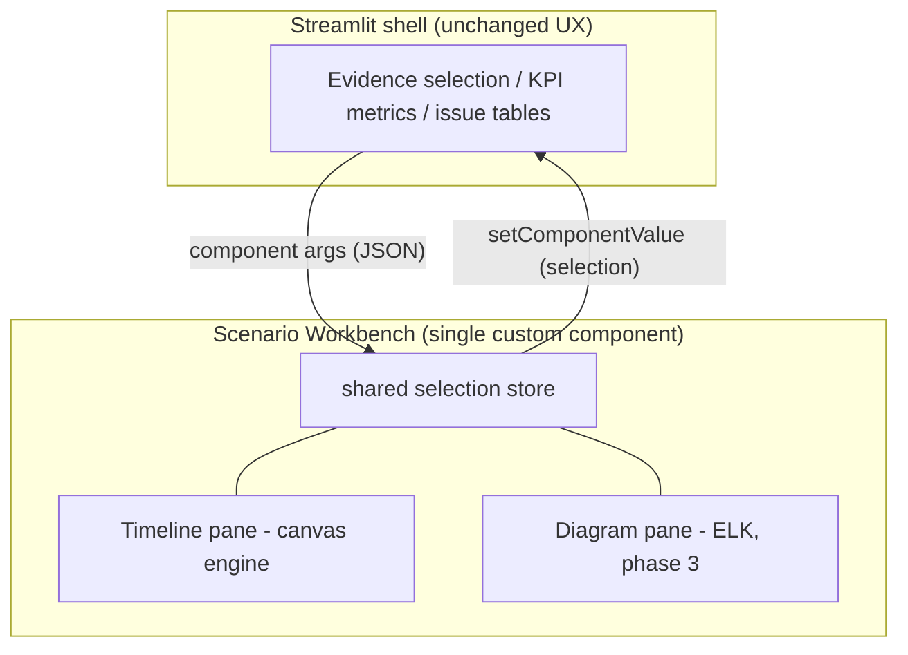

# Scenario Workbench — Interactive Analysis Surface

Status: All five phases implemented — timeline pane (flow arrows, minimap,
search jump, track collapse/pinning, per-track stats, PNG export), the
diagram pane with two-way timeline<->topology cross-probing, semantic zoom
(double-click drill to Level 2 module detail with a breadcrumb back), SVG
export on the ELK views, and the A/B baseline overlay.

## 1. Motivation

The Streamlit dashboard UX (pages, forms, tables, KPI metrics) works well and is
kept as-is. Two visualization surfaces, however, hit structural limits that
cannot be fixed inside the Streamlit rerun model:

- **Timing chart** (`dashboard/components/timing_chart.py`, Plotly): every
  interaction round-trips through a server rerun; no 60fps pan/zoom, no track
  virtualization, no time-range selection with live aggregation, no flow
  arrows, no keyboard navigation.
- **Level scenario viewer** (`dashboard/components/elk_viewer.py`): one-way
  `components.html` string-templated JS; no selection feedback, no semantic
  zoom, hard to maintain.

The enterprise benchmark is Perfetto (trace UI) and Verdi/SimVision
(waveform <-> schematic cross-probing). The defining feature is a **shared
client-side selection model across panes** — which forces the panes to live in
one component, not several iframes glued through Python reruns.

## 2. Architecture decision

Keep Streamlit as the **data-management surface** (selection, forms, CRUD,
tables). Add one bidirectional Streamlit custom component — the **Scenario
Workbench** — as the **analysis surface**. All heavy interaction happens
client-side inside the component; only durable selection results cross the
bridge back into Python.



Rejected alternatives:

- Full SPA migration (`feat/modern-web-spa` style): discards the liked
  Streamlit UX; the SPA branch's shell diverges from the current visual
  language. Its canvas `TimelineEngine` is salvaged instead (see below).
- One component per viewer: cross-probing between two iframes must round-trip
  through a Python rerun (hundreds of ms); hover-level linking impossible.

## 3. Repository layout

```
frontend/                         # Vite + TypeScript workspace (no runtime deps)
  package.json                    # devDeps only: typescript, vite, vitest
  vite.config.ts                  # outDir -> dashboard/components/workbench_frontend/component
  index.html                      # component entry
  src/
    main.ts                       # bootstrap: bridge wiring, DOM shell, tooltip
    bridge/streamlitBridge.ts     # minimal Streamlit component protocol (no npm dep)
    engine/TimelineEngine.ts      # canvas renderer (ported from web/ SPA engine)
    engine/types.ts               # TimelineEvent, TrackDefinition, transforms
    engine/colors.ts              # slice color conventions (port of timing_chart.py)
    engine/tracks.ts              # pure track-building (groups: sync/OTF/M2M/SW)
    engine/aggregate.ts           # pure range-selection statistics
    engine/format.ts              # ms formatting (mirrors timing_chart.format_ms)
    theme.ts                      # light (dashboard-matched) + dark themes
  tests/                          # vitest unit tests for the pure modules
dashboard/components/
  workbench.py                    # Streamlit bridge: declare_component + render API
  workbench_data.py               # pure payload/selection helpers (no streamlit import)
  workbench_frontend/component/   # committed build output (index.html + assets)
```

Notes:

- The build output directory is named `component/`, not `dist/`, because the
  root `.gitignore` ignores `dist/` and `build/` globally. The built assets are
  committed so the dashboard works without a Node toolchain; rebuild with
  `npm run build` from `frontend/`.
- `streamlitBridge.ts` implements the component protocol manually
  (`componentReady` / `render` / `setComponentValue` / `setFrameHeight`)
  to avoid any runtime npm dependency.

## 4. Component interface

### Args (Python -> component, JSON)

```jsonc
{
  "events": [ /* timeline_events rows, passed through unchanged */ ],
  "options": {
    "showWaits": true,          // mirrors existing checkbox
    "showDeadlines": true,      // mirrors existing checkbox
    "theme": "light",           // "light" | "dark"; light matches ui_theme tokens
    "frameIntervalMs": 33.333   // derived: 1000/source_fps, else median frame span
  }
}
```

### Return value (component -> Python)

```jsonc
{
  "selectedTaskId": "isp_task#f1" | null,
  "rangeStartMs": 12.4 | null,   // brush selection (shift+drag)
  "rangeEndMs": 30.1 | null,
  "rangeStats": {                // client-side aggregation over the range
    "eventCount": 12,
    "busyMs": 41.2,
    "resourceWaitMs": 3.1,
    "tokenWaitMs": 0.8,
    "criticalCount": 4
  } | null
}
```

Python uses the returned range to filter the existing critical-path and
wait/slack tables, so brushing in the canvas drives the Streamlit tables —
the first cross-surface link.

### Interaction model (phase 1)

- Drag: pan (time + vertical). Wheel: zoom at cursor. `W/S/A/D` zoom/pan,
  `F` fit, `Esc` clear selection.
- Click slice: select -> report to Python. Shift+drag: brush range -> live
  stats footer + report to Python.
- Hover: HTML tooltip with the same field set as the Plotly hover.
- Viewport survives Streamlit reruns (stable `key` keeps the iframe alive; the
  engine refits only when the event fingerprint changes).

### Visual language (continuity with the Plotly chart)

- Slice colors reuse `timing_chart.py` conventions exactly: source green,
  sink blue, OTF color families keyed by group, M2M orange family, SW purple
  family (ported to `engine/colors.ts`).
- Token-wait (orange, `/` hatch) and resource-wait (slate, `x` hatch) segments
  render before slice start, as in the Plotly overlay.
- Deadline `X` markers colored by effective slack
  (`cadence_slack ?? slack`, green >= 0, red < 0).
- Critical slices get the red border; tracks grouped and ordered
  Sync -> OTF -> M2M -> SW.

## 5. Streamlit integration

`render_timing_chart()` gains a renderer toggle
(`Interactive (beta)` / `Plotly`), defaulting to Interactive when the built
component assets exist, else falling back to Plotly automatically. KPI metric
rows, the Frame filter, the wait/deadline checkboxes, and the issue tables all
stay in Streamlit unchanged — only the chart area swaps.

## 6. Roadmap

1. **Workbench skeleton + timeline pane** (done): engine port, bridge,
   brush selection (Select toggle or shift+drag), table linkage, tests.
2. **Timeline depth** (done): `predecessors`-based flow arrows (click a slice
   for its incoming/outgoing flows, Arrows toggle for the critical-path
   chain), bottom minimap with a draggable viewport window, search jump
   (Enter cycles matches with an n/m counter), track collapse (header click)
   and pinning (pin icon floats tracks to the top), per-track event/busy
   stats, and PNG export of the current view at full backing resolution.
3. **Diagram pane** (done): a compact ELK-layered topology pane beside the
   timeline (ELK loaded from the Streamlit static route). Cross-probe both
   ways — clicking a slice highlights the node it runs on; clicking a node
   glows its events on the timeline and jumps to the first. The full-featured
   diagram remains in the Pipeline Viewer; this pane is purpose-built for
   reading time and structure together.
4. **Semantic zoom + export** (done): double-clicking a topology block drills
   into its Level 2 module detail in place (drill state owned by Streamlit
   session state, requested through the component value), with a breadcrumb
   back to the topology. ELK views gained an SVG export button; the timeline
   exports PNG.
5. **Compare mode** (done): an A/B baseline picker (sibling evidence of the
   same scenario/variant) overlays the baseline as dashed ghost bars under
   matching slices, with delta-start/delta-duration in the tooltip.

## 7. Verification

- `frontend/`: `npm run test` (vitest, pure modules), `npm run build`
  (tsc + vite -> committed assets).
- Python: `uv run --group dev pytest tests/unit/test_workbench_data.py`
  (payload building, frame-interval derivation, selection filtering; no
  streamlit import needed).
- Manual: Evidence Dashboard -> Result breakdown -> Timing Chart -> renderer
  toggle; verify pan/zoom/brush and table filtering.
