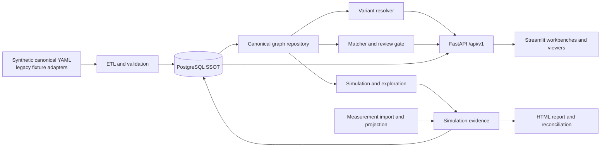

# ScenarioDB System Architecture

| Field | Value |
| --- | --- |
| Status | Current |
| Last verified | 2026-08-26 |
| Scope | `implementation/` backend, dashboard, fixtures, and operations |
| Primary code | `src/scenario_db`, `dashboard`, `alembic`, `tests` |

## 1. Purpose

ScenarioDB converts authored scenario YAML into a PostgreSQL-backed single source of truth,
resolves scenario variants against SoC HW/SW capabilities, evaluates review risks, runs
simulation and comparison flows, and serves viewer-ready projections through FastAPI.

`Project` is the board/form-factor boundary below a SoC. `Scenario` is the reusable use-case
definition, and a `Variant` is a condition/overlay under that scenario. Scenario identifiers are
global DB identities; cross-project comparison uses explicit project scope and
`canonical_usecase` rather than assuming identical IDs.

## 2. Context and data flow

PostgreSQL is the runtime authority for API, query, simulation adapters, and viewer requests.
The dashboard does not read fixture YAML as a fallback. Changing fixture YAML requires ETL reload
and service restart or cache refresh as appropriate.

## 3. Component responsibilities

| Component | Code | Responsibility |
| --- | --- | --- |
| Canonical models | `src/scenario_db/models/` | Pydantic YAML contracts and validation |
| Persistence | `src/scenario_db/db/`, `alembic/` | SQLAlchemy tables, repositories, migrations, JSONB/query indexes |
| ETL | `src/scenario_db/etl/` | Kind dispatch, dependency-ordered upsert, strict validation/reporting |
| Legacy import | `src/scenario_db/legacy_import/` | Synthetic/reference YAML normalization and Write bundle creation |
| Canonical graph | `db/repositories/scenario_graph.py` | Scenario, variant, catalog, issue, and evidence read model |
| Resolver | `src/scenario_db/resolver/` | Requested capability versus catalog resolution |
| Review gate | `review_gate/`, `matcher/` | Issue matching, waiver-aware review decision inputs |
| Write service | `src/scenario_db/write/service.py` | Stage, validate, diff, reviewed-snapshot apply |
| Simulation | `src/scenario_db/sim/` | BW, power, performance, DVFS, topology/timeline calculation |
| Evidence | `models/evidence/`, `db/models/evidence.py` | Simulation/measurement result and lineage storage |
| Comparison/projection | `comparison/`, `meas_import/`, `projection/` | Measurement normalization and prediction comparison |
| Reporting | `src/scenario_db/reporting/` | Atomic HTML generation, metadata, download, reconciliation |
| API | `src/scenario_db/api/` | Auth, resource limits, routers, response schemas, cache lifecycle |
| View projection | `src/scenario_db/view/` | Level 0/1/2 API-neutral graph projection and evidence overlay |
| Dashboard | `dashboard/` | DB Explorer, Pipeline Viewer, Architecture Query, Evidence, Exploration, Import |

## 4. Core invariants

1. PostgreSQL is the runtime source of truth; YAML is an authored/import source.
2. Project and board scope must be explicit on reads and comparisons where identity can collide.
3. Base scenarios may have no variants; callers must not invent dummy variants.
4. Variant overlays are validated against base nodes, buffers, IP catalogs, and inheritance rules.
5. A simulation overlay can be applied only to its own scenario and variant.
6. Compression descriptors and memory/LLC placement are separate concepts.
7. Mutation endpoints are authenticated and role-gated; reads rely on deployment network policy.
8. Repository fixtures and tests remain synthetic and public-safe.

## 5. Runtime processes

- PostgreSQL: default local `127.0.0.1:15432`
- FastAPI: default local `127.0.0.1:18000`
- Streamlit: default local `127.0.0.1:18502`
- pgAdmin: optional local `127.0.0.1:15050`

`SCENARIO_DB_DATABASE_URL` takes priority over `DATABASE_URL`. Server startup requires a real DB
URL. Simulation-backed services require NetworkX and SimPy and must report missing dependencies
as readiness failures rather than silently degrading.

## 6. Change-impact map

| Change | Also inspect |
| --- | --- |
| YAML model | mapper, Alembic/ORM, fixture, strict ETL tests, API schema |
| Variant overlay | integrity checks, resolver, Write validation/diff, viewer projection |
| API response | response schema, dashboard client, contract doc, unit/integration tests |
| Simulation field | evidence model/ORM, comparison, reporting, dashboard tables |
| Metric catalog | import normalization, comparison statistic/unit, dashboard coverage |
| Viewer level/mode | service validation, schema, golden tests, dashboard selection |
| Auth/resource setting | startup validation, router dependency, deployment guide, guard tests |

## 7. Related documents

- [Ingestion and PostgreSQL SSOT](ingestion-and-ssot.md)
- [Simulation and Evidence](simulation-and-evidence.md)
- [Viewer and Projection](viewer-and-projection.md)
- [Security and Write Lifecycle](security-and-write-lifecycle.md)
- [Maintenance Guide](../operations/maintenance-guide.md)
