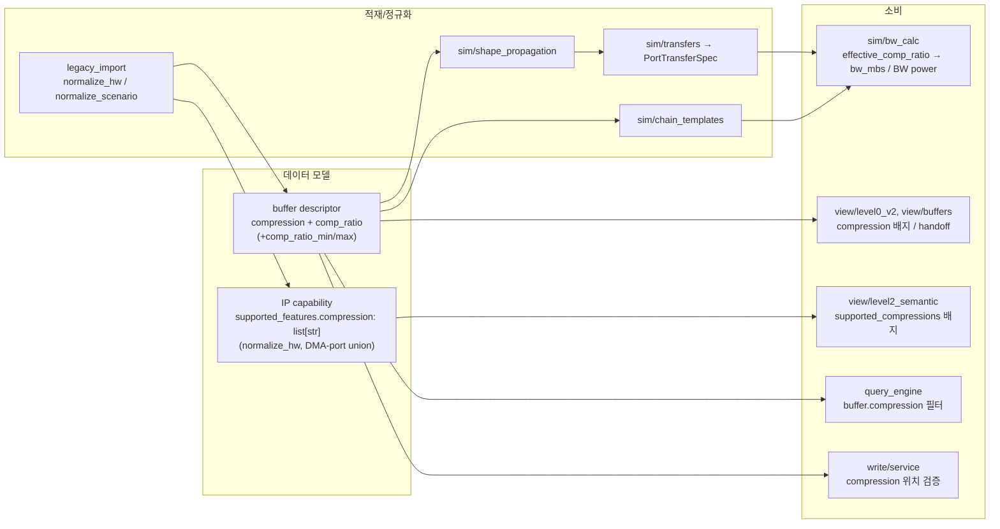

# DMA Compression 처리 현황 조사 (survey)

> branch `feat/dma-compression` · 코드 변경 없음(read-only 조사). 후속 작업 결정을 위한 근거 문서.
> 기준 커밋: `3fff0d5`.

## 1. 데이터 흐름 한눈에



## 2. 데이터 모델 정의

| 위치 | 필드 | 의미 |
|---|---|---|
| IP capability (`normalize_hw.py:144`) | `capabilities.supported_features.compression: list[str]` | DMA 포트들의 `supported_compressions` 합집합(sorted). HW가 **지원 가능한** 압축 모드 목록 |
| buffer descriptor | `compression: str`, `comp_ratio: float` | 실제 버퍼에 **적용된** 압축 모드/비율. view는 `compression_ratio` 별칭도 읽음(`level0_v2.py:728`) |
| `PortTransferSpec` (`sim/models.py:47-50`) | `compression="disable"`, `comp_ratio=1.0`, `comp_ratio_min/max` | sim 입력. min/max로 best/worst BW |
| `PortBWResult` (`sim/models.py:198-199`) | `compression`, `comp_ratio` | sim 출력 |

## 3. BW 반영 공식 (단일 지점, 정상)

`bw_calc.py:13`
```
bw_mbs = comp_ratio * fps * width * height * (bitwidth/8) * format_bpp_factor * r_w_rate / 1e6
```
- `effective_comp_ratio(spec)` = `spec.comp_ratio` (압축 on) / `1.0` (압축 off) — `bw_calc.py:114`.
- best/worst = `comp_ratio_min/max`, 단 `compression_enabled`일 때만 산출 — `bw_calc.py:103-111`.
- `bw_power_mw = bw_mbs * bw_power_coeff/1000 * llc_weight` → mA 환산. **압축은 BW와 BW-power에만 영향**, OTF 포트는 BW=0.

## 4. 중복 / 불일치 (정리 대상)

### 4.1 "압축 꺼짐" 센티넬 값이 제각각
| 코드 | 꺼짐 표현 |
|---|---|
| `sim/models.py`, `chain_templates`(기본값) | `"disable"` |
| `normalize_scenario._compression` 출력(`:498`) | `"none"` (켜짐은 `"enabled"`) |
| view (`buffers.py:50`, `level0_v2.py:622`) | `== "none"`만 None 처리 |
| `bw_calc.compression_enabled`(`:118`) | `{"", "none", "no", "false", "off", "disable", "disabled", "comp_off"}` |

→ **`compression_enabled`만 넓게 포섭**. view는 `"disable"`/`"off"`를 그대로 배지로 노출(표시 vs sim 판정 불일치). legacy는 `"enabled"`/`"none"`이라는 또 다른 어휘를 만들어냄(실제 알고리즘명 아님).

### 4.2 compression 입력 키 이름 파편화
- `compression` / `comp` / `comp_mode` / `sensor_sbwc` / `output_compression`
- `transfers.py:39`, `shape_propagation.py:188,269,303,327`, `chain_templates.py:280,234`
- 각자 fallback 체인이 달라 같은 의미를 다르게 읽음.

### 4.3 comp_ratio 게이팅 로직 중복
- `bw_calc`: `effective_comp_ratio`(`:114`) + `_optional_bw` 게이팅(`:109`)
- `chain_templates`: `:289-290`, `:312-314` (동일하게 `compression_enabled` 후 comp_ratio 채택)
- 같은 규칙("압축 꺼지면 comp_ratio 무시")이 3곳에 손으로 반복.

## 5. 검증 gap

| gap | 현황 | 영향 |
|---|---|---|
| capability ↔ 실제값 정합 | `write/service`는 compression이 `placement`에 잘못 들어간 경우만 검증(`:1532`). buffer.compression이 그 DMA 포트의 `supported_compressions`에 속하는지 **검사 없음** | 미지원 IP에 SBWC 선언해도 sim이 comp_ratio를 그대로 적용 → 비현실적 BW 절감 |
| view 압축 IP 귀속 | `buffers.py:_compression_for_buffer`(`:180`)는 **ip_catalog의 첫 IP의 첫 압축 capability**를 반환(버퍼 생산 IP 무관) | multi-IP 그래프에서 오귀속 가능 |
| comp_ratio 범위 검증 | comp_ratio가 (0,1] 범위인지 검증 없음 | >1 입력 시 BW가 부풀려짐 |

## 6. 후속 작업 후보

1. **센티넬/키 정규화 SSOT** — `compression_enabled` 옆에 `normalize_compression(value)` 단일 함수를 두고 view·legacy·sim·chain이 공유. "off" 표현 통일, `comp`/`comp_mode`/`sensor_sbwc` 별칭 흡수.
2. **comp_ratio 게이팅 통합** — `effective_comp_ratio` 하나를 chain_templates/level0도 재사용해 3중 중복 제거.
3. **capability 정합 검증** — `write/service`에 buffer.compression ∈ 생산 DMA 포트 `supported_compressions` 검사(+comp_ratio 범위) 추가.
4. **view 귀속 정정** — `_compression_for_buffer`를 버퍼 생산 IP 기준으로 수정.

> 우선순위 제안: (4.1 불일치가 표시 신뢰성에 직접 영향) **1 → 2 → 3 → 4**.

---

# 7. 확정 설계 (compression 데이터 모델 통일)

> 사용자 결정 반영. 후속 구현은 이 절을 계약으로 한다.

## 7.1 핵심 원칙
1. **지원 여부는 per-DMA가 SSOT.** IP 상단 `supported_features.compression`은 제거(또는 per-DMA union의 읽기전용 파생). 현재 둘이 불일치(ISP 상단은 BAYER만, MCSC 포트는 SBWC까지) → per-DMA로 단일화.
2. **`COMP_OFF`는 암묵.** 압축을 지원하는 DMA만 `supported_compressions`에 실제 mode를 나열. 미선언 포트 = 무압축만 지원. OFF는 어디에도 안 적어도 항상 허용(ratio=1.0).
3. **type(압축기)은 명시 필드** `compressor: SBWC | SAJC | NONE`. mode 이름에서 추측하지 않음.
4. **mode→ratio는 SoC 카탈로그에서 도출.** scenario buffer는 mode 이름만 선택. `buffer.comp_ratio`는 **exploration override로만** 허용(없으면 카탈로그 ratio, 있으면 경고 후 우선).
5. **mode 이름 규약**: `{COMPRESSOR}_{FORMAT}_{LOSSLESS|LOSSY}` (예: `SBWC_BAYER_LOSSLESS`, `SBWC_YUV_LOSSY`, `SAJC_RGB`). 기존 `COMP_*` 혼용 정리.

## 7.2 스키마

```yaml
# soc-*.yaml — mode→특성/ratio 단일 카탈로그 (HW 선언). OFF는 등재 불필요.
compression_modes:
  SBWC_BAYER_LOSSLESS: {compressor: SBWC, lossy: false, comp_ratio: 1.0}
  SBWC_BAYER_LOSSY:    {compressor: SBWC, lossy: true,  comp_ratio: 0.5}
  SBWC_YUV_LOSSLESS:   {compressor: SBWC, lossy: false, comp_ratio: 1.0}
  SBWC_YUV_LOSSY:      {compressor: SBWC, lossy: true,  comp_ratio: 0.5}
  SAJC_RGB:            {compressor: SAJC, lossy: true,  comp_ratio: 0.6}

# ip-*.yaml DMA 포트 — 지원 mode '이름'만. OFF만 지원하면 필드 생략.
modules:
  - {name: MCSC_WDMA_VIDEO, type: DMA, direction: write, supported_compressions: [SBWC_YUV_LOSSLESS, SBWC_YUV_LOSSY]}
  - {name: 3AA_RDMA,        type: DMA, direction: read}   # 압축 미지원(OFF only)

# scenario buffer — mode만. comp_ratio는 override일 때만.
buffers:
  record_out: {format: NV12, compression: SBWC_YUV_LOSSY}        # ratio=0.5 (카탈로그)
  scratch:    {format: NV12, compression: SBWC_YUV_LOSSY, comp_ratio: 0.42}  # override+경고
```

## 7.3 해석 경로 (resolution)
- ratio 해석은 `transfers.py`(PortTransferSpec 빌드 시점)로 **일원화**: `comp_ratio = override or 카탈로그[mode].comp_ratio or 1.0`. `bw_calc`는 이미 해석된 `spec.comp_ratio`만 사용(순수 유지).
- `bw_calc.compression_enabled`/view의 `=="none"` 산재 → 단일 `normalize_compression()` + OFF 판정으로 통일.

## 7.4 검증 (write/service)
- `buffer.compression` ∈ (생산 DMA 포트의 `supported_compressions` ∪ {OFF}) 이어야 함. 위반 시 error.
- `comp_ratio` override는 (0,1] 범위. 벗어나면 error, 명시 시 warning.

## 7.5 구현 단계 (이 worktree)
1. **스키마+카탈로그**: `CompressionMode` 모델 + `SocPlatform.compression_modes`; per-DMA typed; soc/ip fixture를 새 규약으로 정리, IP 상단 stale 목록 제거.
2. **해석/BW 통일**: `transfers.py`에서 mode→ratio 해석, `normalize_compression()` 단일화, chain_templates/shape_propagation/level0 재사용.
3. **검증**: write/service 정합·범위 검사 + 테스트.
4. **view/query 정렬**: `_compression_for_buffer` 생산 IP 귀속 정정, 배지/필터 새 규약 반영.

## 7.6 미해결/주의
- 카탈로그 조회는 `CanonicalScenarioGraph`에 SoC 문서가 있어야 함 → 로더가 sim 시점에 SoC를 물려주는지 1단계에서 확인.
- 기존 fixture 적재본(DB) 재적재 필요. fixture mode 이름 변경은 query/대시보드 표시에 영향.
