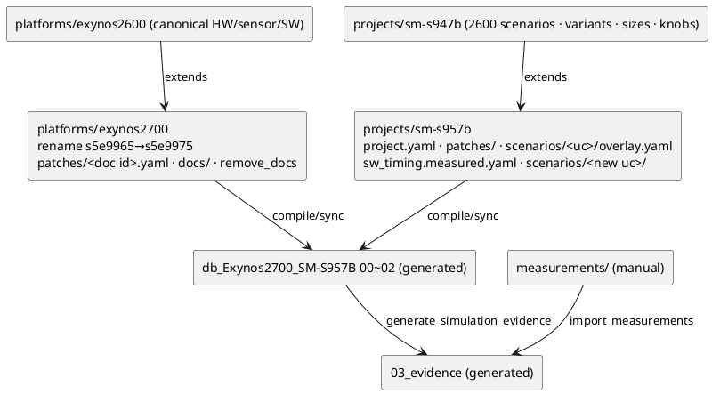

# Exynos2700 (SM-S957B) data 수정 가이드

사내에서 Exynos2700 IP·scenario·sensor 정보를 바꿀 때의 절차와 예시.
일반 개념(상속, overlay, knob)은 [authoring-layers-guide-ko.md](authoring-layers-guide-ko.md)를 먼저 본다.
이 문서의 예시는 모두 `tests/unit/authoring/test_authoring_2700_cases.py`에서 compile·검증된다.

---

## 0. 원칙

**`db_Exynos2700_SM-S957B/`의 `00_hw`, `00_sensor`, `01_sw`, `02_definition`은 직접 수정하지 않는다.**
이 파일들은 `authoring/`에서 compile된 생성물이다.

- `dev_up.ps1`이 `sync --to fixture --prune`으로 매번 덮어쓴다. 직접 고친 내용은 조용히 사라진다.
- `test_exynos2700_db_folder_matches_authoring`이 authoring과 다르면 실패한다.
- 직접 수정해도 되는 것은 `measurements/<variant>/`(실측 입력)뿐이다.



| 무엇을 바꾸나 | 어디를 고치나 |
|---|---|
| IP 사양 (clock, PPC, unit power, mode, DMA port, compression 지원) | `authoring/platforms/exynos2700/patches/ip-<name>-s5e9975.yaml` |
| 2700 전용 새 IP, DVFS table 전체 교체 | `authoring/platforms/exynos2700/docs/00_hw/<file>.yaml` |
| SoC compression ratio 등 SoC 속성 | `authoring/platforms/exynos2700/patches/soc-exynos2700.yaml` |
| sensor mode / timing / lineup | `authoring/platforms/exynos2700/patches/{ip-sensor-*,sensortiming-*,sensor-*,board-lineup-*}-s5e9975.yaml` |
| scenario / variant (EIS, size, 조건, 연결) | `authoring/projects/sm-s957b/scenarios/uc-cam-recording-e2600/overlay.yaml` |
| SW task 실측 timing | 같은 폴더의 `sw_timing.measured.yaml` |
| scenario 추가 | `project.yaml`의 `scenarios.include`, 또는 `scenarios/<new uc id>/` |
| 과제 설정 (sim config) | `authoring/projects/sm-s957b/patches/simcfg-proj-sm-s957b-v1.yaml` |
| 실측 power / BW / latency | `db_Exynos2700_SM-S957B/measurements/<variant>/` (직접 수정. 수정할 때마다 `provenance.revision` +1) |

patch 파일 이름은 **2700에서 rename된 문서 id**다 (예: `ip-mcsc-is-v15-s5e9975`, `sensortiming-s5kgng-seta-19p2-s5e9975`).
생성된 `db_Exynos2700_SM-S957B/00_hw/*.yaml`의 `id:` 값을 확인해서 쓴다.

2600 쪽(`platforms/exynos2600`, `projects/sm-s947b`)을 고치면 2700에도 전파된다.
2700에만 해당하는 값은 반드시 2700 layer에 둔다.

---

## 1. 작업 절차

```powershell
cd <repo>\implementation

# 1) 수정 → compile 결과 미리 보기 (DB 폴더는 건드리지 않는다)
uv run python -m scenario_db.authoring compile sm-s957b --out output\preview
uv run python -m scenario_db.authoring sync sm-s957b --fixture db_Exynos2700_SM-S957B --to fixture --dry-run

# 2) HW / SW / topology / size를 바꿨으면 simulation evidence를 재생성한다 (dev_up이 하지 않는다)
uv run python scripts/generate_simulation_evidence.py db_Exynos2700_SM-S957B uc-cam-recording-e2700

# 3) DB 반영: rename → retire → ETL 2600 → [sync → measurement import → ETL] 2700
powershell -ExecutionPolicy Bypass -File scripts\dev_up.ps1 -NoUi

# 4) 검증
uv run --group dev pytest -q tests/unit/authoring tests/unit/test_exynos2700_db_contract.py
```

- 2)를 빠뜨리면 예측 column과 Pipeline timing diagram이 이전 값으로 남는다. stale test가 params_hash로 이를 잡는다.
- 입력이 바뀌었으므로 **조합 탐색을 다시 실행하고 예측을 재등록**한다. 예측 현황의 변경 원인(LMDI)이 patch의 효과를 보여 준다.
- compile 오류는 파일과 id를 알려 준다. 예: `unknown doc id`, `patch unknown name=...`, `patch_resolved[0] selects no variant`.

---

## 2. Patch 문법

patch는 상속 문서에 deep-merge된다.

| 형태 | 동작 |
|---|---|
| `key: value` | dict는 재귀 merge. 그 외 값(list 포함)은 **통째로 교체** |
| `$unset: [k1, k2]` | key 삭제 |
| `$append: {key: [items]}` | list에 추가 (중복 제외) |
| `$remove: {key: [items]}` | list에서 제거. dict 항목은 selector다: 지정한 key가 같은 항목을 모두 제거 (`{from: mcsc, to: dpu}`) |
| `$items: {key: {by: name, patch: {ID: {...}}, remove: [ID], add: [{...}]}}` | id 필드(`by`, 기본값 `id`)로 list의 **한 항목만** 수정·삭제·추가한다. 없는 id를 patch/remove하거나 이미 있는 id를 add하면 오류 |

적용 순서: `$unset` → `$remove` → `$append` → `$items` → 일반 key.

---

## 3. IP 속성 변경

### 3.1 unit power / PPC / clock / idc

```yaml
# authoring/platforms/exynos2700/patches/ip-mcsc-is-v15-s5e9975.yaml
capabilities:
  sim:
    source: exynos2700_arch_rev1          # 출처는 필수로 남긴다 (report / UI의 가정 표시)
    source_note: 2700 MCSC spec v0.9, power = PTPX 2026-10
    modes:
      Normal:
        ppc: 8.0                          # 나머지 필드(idc, vdd, dvfs_group)는 상속된다
        unit_power_mw_mp: 1.2
```

- IP power 모델은 `P = unit_power_mw_mp · MP · (V/710mV)² · (fps/30)`이다.
- 요구 clock = 처리 pixel / ppc (+ sw_margin)이다.
- mode별 max clock은 `capabilities.operating_modes[id=<mode>].max_clock_mhz`로 준다.

### 3.2 mode 추가 / mode별 unit power

```yaml
# 같은 patch 파일
capabilities:
  operating_modes:                        # list → 통째로 교체 (기존 mode도 같이 적는다)
  - {id: Normal}
  - {id: SBWC}
  - {id: HDR10P}
  - {id: LowPower, max_clock_mhz: 533}
  sim:
    modes:
      LowPower:
        unit_power_mw_mp: 0.9
        ppc: 8.0
        idc: 0.0
        vdd: VDD_CAM
        dvfs_group: CAM
        # 아래 3줄: 화질 평가가 필요한 power-saving option으로 조합 탐색에 포함 (선택)
        substitutes: [Normal]
        iq_eval: required
        label: MCSC low power
```

mode의 두 가지 용도:

| 용도 | 방법 |
|---|---|
| 특정 variant가 항상 그 mode로 동작 (정식) | variant의 `node_configs.<node>.selected_mode: LowPower` (§4.3 `patch_resolved`) |
| 절감 후보로 예측만 (IQ 평가 전) | 위의 `substitutes: [Normal]`. 조합 탐색 → 예측 현황의 "절감 option"에 나온다. variant는 만들지 않는다 |

### 3.3 DMA port

DMA port 정보는 두 곳에 있다.

| 위치 | 쓰임 | 수정 방법 |
|---|---|---|
| IP `capabilities.properties.modules[]` (`name`, `type`, `direction`, `supported_compressions`) | Pipeline 상세 view, write 검증, **탐색의 port별 compression 지원 판정** | IP patch의 `$items` |
| scenario `pipeline.edges[].port_pairs` / buffer | **simulation의 DMA 전송량** (어느 port로 몇 byte) | overlay `pipeline` 연산 |

```yaml
# IP catalog: port 한 개만 수정 / 삭제 / 추가
# authoring/platforms/exynos2700/patches/ip-mcsc-is-v15-s5e9975.yaml
capabilities:
  properties:
    $items:
      modules:
        by: name
        patch:
          MCSC_WDMA_W1: {supported_compressions: [COMP_OFF, COMP_YUV_LOSSLESS]}
        remove: [MCSC_WDMA_W4]
        add:
        - {name: MCSC_WDMA_W5, type: DMA, direction: write, supported_compressions: [COMP_OFF]}
```

```yaml
# scenario: port 이름 변경 / 연결 변경
# authoring/projects/sm-s957b/scenarios/uc-cam-recording-e2600/overlay.yaml
pipeline:
  rename_ports: {MCSC_WDMA_W1: MCSC_WDMA_W5}      # edges + variant topology 전체에서 교체
  remove_edges:
  - {from: mcsc, to: gdc_o}
  add_edges:
  - from: mcsc
    to: gdc_o
    type: M2M
    buffer: MCSC_VIDEO
    port_pairs: [{src: MCSC_WDMA_W5, dst: GDC_RDMA}]
  add_buffers:                                     # 새 buffer (size_ref는 anchor 이름)
    MCSC_VIDEO2: {size_ref: record_out, format: YUV420, bitdepth: 10, compression: COMP_OFF}
```

IP catalog의 module 이름과 scenario의 port 이름은 **같게** 유지한다. 탐색이 이 이름으로 port별 compression 지원을 찾는다.

### 3.4 Compression 지원 여부 / 기본값 / ratio

| 항목 | 위치 | 탐색 영향 |
|---|---|---|
| IP 수준 지원 | IP `capabilities.supported_features.compression` (list 교체) | endpoint IP 중 하나라도 지원이 없으면 그 buffer는 `unsupported` |
| DMA port 수준 지원 | IP `properties.modules[name].supported_compressions` (`$items`) | buffer를 압축할 때 영향받는 port 중 하나라도 그 mode를 지원하지 않으면 다음 mode를 시도한다. 모든 mode가 막히면 선택 불가 (`DMA port without COMP_YUV_LOSSY: mfc_enc.MFC_RDMA`) |
| scenario 기본 압축 | `pipeline.buffers.<BUF>.compression` (overlay `scenario_patch`) | 이미 압축된 buffer는 탐색 대상에서 제외 |
| ratio | SoC `compression_modes.<MODE>.comp_ratio` | 탐색·simulation의 BW 감소량 |

```yaml
# 기본으로 압축하는 buffer (정식 구성)
# overlay.yaml
scenario_patch:
  pipeline:
    buffers:
      MCSC_VIDEO: {compression: COMP_YUV_LOSSLESS}
```

```yaml
# SoC compression ratio
# authoring/platforms/exynos2700/patches/soc-exynos2700.yaml
compression_modes:
  COMP_YUV_LOSSY: {comp_ratio: 0.45}
  COMP_YUV_LOSSLESS: {comp_ratio: 0.8}
```

현재 data에서 MFC_RDMA와 DPU_RDMA는 `COMP_OFF, COMP_YUV_LOSSLESS`만 지원한다. 그래서 GDC_VIDEO/GDC_PREVIEW의 lossy 압축은 선택되지 않는다.
lossless ratio가 1.0보다 작으면 조합 탐색 폼에서 `lossless`를 켜야 lossless 후보가 나온다.

### 3.5 새 IP / IP 교체

```yaml
# 1) authoring/platforms/exynos2700/docs/00_hw/ip-mfc-v2-s5e9975.yaml  (새 문서 전체)
id: ip-mfc-v2-s5e9975
schema_version: '2.2'
kind: ip
category: codec
hierarchy: {type: simple}
capabilities:
  sim:
    hw_name: MFC
    source: exynos2700_arch_rev1
    modes:
      Normal: {unit_power_mw_mp: 0.8, ppc: 8.0, idc: 0.0, vdd: VDD_MFC, dvfs_group: MFC}
  supported_features: {compression: [COMP_OFF, COMP_LOSSLESS]}
  properties:
    modules:
    - {name: MFC_RDMA, type: DMA, direction: read, supported_compressions: [COMP_OFF, COMP_YUV_LOSSLESS]}
compatible_soc: [soc-exynos2700]
```

```yaml
# 2) scenario에서 node를 새 IP로 연결 — overlay.yaml
pipeline:
  set_nodes:
    mfc_enc: {ip_ref: ip-mfc-v2-s5e9975}
```

```yaml
# 3) SoC IP 목록 — patches/soc-exynos2700.yaml (list는 통째로 교체되므로 $items 사용)
$items:
  ips:
    by: ref
    add: [{ref: ip-mfc-v2-s5e9975, instance_count: 1}]
```

2700에 없는 IP 문서는 `platform.yaml`의 `remove_docs: [ip-xxx-s5e9975]`로 뺀다.
참조하는 scenario node가 남아 있으면 compile이 오류를 낸다.

### 3.6 DVFS table

`authoring/platforms/exynos2700/docs/00_hw/dvfs-exynos2700-<rev>.yaml`에 새 문서로 넣는다 (`kind: soc.dvfs_table`, `soc_ref: soc-exynos2700`).
현재 `dvfs-exynos2700-sample-v0`은 SAMPLE이다. report와 UI에 SAMPLE로 표시된다.

---

## 4. Scenario 수정

2700 recording은 `uc-cam-recording-e2600` overlay 하나로 관리한다.

| overlay key | 대상 | 비고 |
|---|---|---|
| `scenario_patch` | scenario 본문 (metadata, pipeline buffers, size_profile) | deep-merge |
| `pipeline` | node/edge/buffer 추가·삭제·교체, port rename | §3.3 |
| `variants.keep` | 출력할 variant와 순서 | 나머지는 `extends`용 template으로만 쓰인다 |
| `variants.add` | 새 variant (`extends` + patch) | |
| `variants.patch` | compact entry 하나를 deep-merge | 상속된 list에는 `$remove`가 닿지 않는다 → 아래 `patch_resolved`를 쓴다 |
| `variants.patch_resolved` | **extends를 펼친 뒤** 여러 variant에 일괄 patch | 선택자: `variants`(목록 또는 `'*'`), `exclude`, `when`(design_conditions, list는 OR), `when_node_enabled`, `when_node_disabled`. 아무 variant도 고르지 않으면 오류 (오타 방지) |
| `sizes` | sizes.yaml bindings / derived | §4.2 |
| `knobs` | knobs.yaml | power option |

### 4.1 EIS를 default로 켜기

2600에서 EIS가 꺼진 variant는 세 가지 방식으로 EIS를 끈다.
- `routing_switch.disabled_nodes`에 `eis`, `gdc_m`, `gdc_o`가 들어 있다.
- `topology_patch.add_edges`에 MCSC→DPU/MFC 우회 edge가 있다.
- `design_conditions.stabilization`이 없거나 false다.

2700에서 EIS를 켜려면 세 가지를 모두 되돌린다.

```yaml
# overlay.yaml
variants:
  keep: [...]
  patch_resolved:
  - note: 2700 EIS(VDIS) default on
    variants: [cam-rec-r1-uhd60-psm, cam-rec-r1-uhd30-portrait]   # 또는 '*' + exclude / when
    patch:
      design_conditions:
        stabilization: SWVDIS
        is_scenario: IS_SCENARIO_SWVDIS
      routing_switch:
        $remove: {disabled_nodes: [eis, gdc_m, gdc_o]}
      topology_patch:
        $remove:
          add_edges:
          - {from: mcsc, to: dpu}
          - {from: mcsc, to: mfc_enc}
```

조건으로 고를 수도 있다. 예: EIS가 꺼진 30/60 fps KPI variant 전체.

```yaml
  - note: 2700 EIS on for 30/60fps
    variants: '*'
    exclude: [cam-rec-r1-8k30-psm]
    when: {fps: [30, 60]}
    when_node_disabled: eis
    patch: {...같은 patch...}
```

- high-speed variant(fhd120/240, uhd120)는 `remove_edges: [{from: mcsc, to: gdc_o}]`와 공유 buffer(MCSC_PREVIEW)까지 바꾼다. 켜려면 `topology_patch`를 variant별로 확인한다.
- EIS를 켜면 knob param rule(`eis_margin_pct 15`)과 power option(bcrop)이 자동으로 따라온다. 확인: `test_eis_enabled_variant_simulates_with_eis_stage`, UHD60 PSM 995 → 1352 mW (sample DVFS).
- `eis` SW task timing은 모든 variant에 이미 있다 (`sw_timing.yaml` `eis-a`). 2700 실측은 `sw_timing.measured.yaml`의 `eis` 항목에 넣는다.

### 4.2 Size 변경

각 variant는 `size_overrides`에 anchor 값을 직접 갖고 있다 (sensor_full, record_out, mlsc_out, pyramid_l0~l4 …).
그래서 `size_profile.anchors`(scenario 기본값)만 바꾸면 적용되지 않는다. variant의 `size_overrides`를 바꾸고,
의존 anchor는 `sizes.derived`에 `force: true`로 다시 계산시킨다.

```yaml
# overlay.yaml — 예: 2700 sensor 출력 crop 4080x2296 → 4000x2252
variants:
  patch_resolved:
  - note: 2700 sensor crop
    variants: [cam-rec-r1-fhd30-vdis, cam-rec-r1-uhd30-vdis, cam-rec-r1-uhd60-psm]
    patch:
      size_overrides: {sensor_full: 4000x2252}
sizes:
  derived:                      # 위에서부터 의존 순서 무관 (자동 정렬)
    mlsc_out:   {from: sensor_full, force: true}
    pyramid_l0: {from: mlsc_out, force: true}
    pyramid_l1: {from: pyramid_l0, scale: 0.5, round: ceil, force: true}
    pyramid_l2: {from: pyramid_l1, scale: 0.5, round: ceil, force: true}
    pyramid_l3: {from: pyramid_l2, scale: 0.5, round: ceil, force: true}
    pyramid_l4: {from: pyramid_l3, scale: 0.5, round: ceil, force: true}
```

- `sizes.bindings`에 연결된 node(byrp·rgbp·…·mcsc = sensor_full, gdc_o/mfc_enc = record_out, dpu = preview_out)의 `sim.width/height`는 anchor를 따라 자동으로 바뀐다.
  결과: uhd30-vdis의 rgbp가 4000x2252, pyramid_l1 2000x1126, l4 250x141이 된다.
- derived rule 문법은 knob과 같다: `from`, `scale` / `scale_x` / `scale_y` (숫자 또는 식), `align` / `align_x` / `align_y`, `round: ceil|nearest`, `clamp_to`.
- `force: true`가 없으면 variant의 기존 값이 우선한다.
- 녹화 해상도 변경: `size_overrides: {record_out: 3840x2160}`.
- node 하나만 다른 크기: `node_configs.<node>.sim: {width: ..., height: ...}`. 직접 준 값이 binding보다 우선한다.
- bcrop 같은 knob은 derived 다음에 계산된다. knob이 만든 anchor는 이 결과 위에 덮인다.
- sensor mode를 바꾸면 sensor 입력 크기(`sensor_size`)와 fps가 바뀐다 (§6.3). crop이나 ISP 처리 크기는 위처럼 `size_overrides`로 맞춘다.

### 4.3 조건 / mode / SW 일괄 변경

```yaml
variants:
  patch_resolved:
  - note: 2700 PSM variants use MFC LowPower + DPU 2 layers
    when: {power_saving_mode: true}          # uhd60-psm, 8k30-psm, uhd60-pro(psm 상속)
    patch:
      design_conditions: {dpu_layer_count: 2}
      node_configs:
        mfc_enc: {selected_mode: LowPower}
```

### 4.4 variant 추가 / 제외

```yaml
variants:
  keep: [..., cam-rec-r1-uhd30-hdr10]         # 2600 template을 그대로 출력에 포함
  add:
  - id: cam-rec-r1-uhd30-log
    extends: cam-rec-r1-uhd30-vdis
    design_conditions: {camera_mode: log_video, hdr: LOG}
```

- 이미 DB에 적재된 variant를 빼려면 `keep`에서 제거하고 `authoring/retired.yaml`에도 추가한다. Exynos2600은 retire 대상이 아니다.
- IQ 평가가 필요한 절감안(bcrop, L0 skip, low-power mode)은 variant로 만들지 않는다. knob의 `explore`나 IP mode의 `substitutes`로 선언한다 (layers guide 예제 5).

---

## 5. Scenario 추가

### 5.1 2600의 기존 scenario를 2700에 포함

```yaml
# authoring/projects/sm-s957b/project.yaml
scenarios:
  include:
  - uc-cam-recording-e2600
  - uc-cam-preview-e2600          # → uc-cam-preview-e2700
```

**주의**: `authoring/retired.yaml`의 2026-09-27 항목에 `uc-cam-preview-e2700` 등이 retire 대상으로 들어 있다.
다시 포함하려면 retired 목록에서 **먼저 지운다**. 지우지 않으면 dev_up이 매번 삭제한 뒤 다시 적재해서, 등록 예측과 evidence가 사라진다.
포함한 scenario를 2700에 맞게 바꾸려면 `scenarios/uc-cam-preview-e2600/overlay.yaml`을 만든다.

### 5.2 기존 scenario를 복제해서 새 scenario 만들기

새 폴더 이름이 새 scenario id다. `from`에는 2600 scenario id(authoring 폴더 이름)를 쓴다.
`from` 외의 key는 일반 overlay와 같다.

```yaml
# authoring/projects/sm-s957b/scenarios/uc-cam-recording-night-e2700/overlay.yaml
kind: authoring.scenario_overlay
from: uc-cam-recording-e2600
# canonical_usecase: uc-cam-recording-night   # 생략 시 id에서 -e2700을 뗀 값 (과제 간 비교 키)
scenario_patch:
  metadata: {name: Camera Recording (Night)}
variants:
  keep: [cam-rec-r1-fhd30-night, cam-rec-r1-uhd30-night]
  add:
  - {id: cam-rec-r1-fhd30-night, extends: cam-rec-r1-fhd30-vdis, design_conditions: {night_mode: true}}
  - {id: cam-rec-r1-uhd30-night, extends: cam-rec-r1-uhd30-vdis, design_conditions: {night_mode: true}}
  patch_resolved:
  - variants: '*'
    patch:
      design_conditions: {scene: low_light}
```

- 결과는 `02_definition/uc-cam-recording-night-e2700.yaml`이다. project는 `proj-sm-s957b`, IP id는 `-s5e9975`로 rename된다.
- sizes / sw_timing / knobs는 원본 scenario에서 상속된다.
- SW 실측은 같은 폴더의 `sw_timing.measured.yaml`에 넣는다.

### 5.3 완전히 새 scenario

`authoring/projects/sm-s957b/scenarios/<uc id>/`에 root 형식 파일을 둔다.
- `scenario.yaml`: pipeline, anchors, `variants: {$include: variants.yaml}`
- `variants.yaml`
- `sizes.yaml`
- `sw_timing.yaml`
- `knobs.yaml` (선택)

형식은 `projects/sm-s947b/scenarios/*`와 같다. IP id는 `-s5e9975`, `project_ref: proj-sm-s957b`로 직접 쓴다.
pipeline이 기존 scenario와 비슷하면 5.2가 훨씬 간단하다.

---

## 6. Sensor 정보 수정

| 대상 | 문서 id (patch 파일명) | 내용 |
|---|---|---|
| sensor timing (line length, frame length, pixel clock) | `sensortiming-s5kgng-seta-19p2-s5e9975` | `modes.<mode>` dict |
| sim용 sensor mode (크기, fps, MIPI, lane) | `ip-sensor-gng-s5e9975` | `capabilities.properties.modes.<mode>` |
| module / CSIS wiring / mode→timing binding | `sensor-gng-m2s-s5e9975` | `module_properties`, `csis_wiring`, `modes.<mode>.timing_binding` |
| board별 sensor 배치 | `board-lineup-s5e9975` | `boards.<board>.configs[].lineup` |
| variant가 쓰는 sensor mode | overlay `patch_resolved` | `node_configs.sensor_rear.selected_mode` |

### 6.1 timing / mode 값 수정

```yaml
# authoring/platforms/exynos2700/patches/sensortiming-s5kgng-seta-19p2-s5e9975.yaml
revision: 2700-evt0-20261001
modes:
  cis_4sum_ln4_raw10_4080x2296_30fps_3993msps:
    line_length_pck: 15000                 # 나머지 필드는 상속
    source: {basis: 2700 EVT0 setfile, path: is-cis-gng-2700.h}
```

```yaml
# authoring/platforms/exynos2700/patches/ip-sensor-gng-s5e9975.yaml
capabilities:
  properties:
    modes:
      mode0: {sensor_mipi_speed: 4.5}
```

### 6.2 새 mode 추가

위의 `modes`에 새 key를 추가하면 된다 (dict라서 다른 mode는 유지).
- `ip-sensor-*`의 `operating_modes`는 list다. 새 mode id를 포함해 전체를 다시 적는다.
- 새 timing mode를 catalog에 연결하려면 `sensor-gng-m2s-s5e9975`의 `modes.<mode>.timing_binding`에 `profile_ref`와 `mode_label`을 준다.

### 6.3 variant의 sensor mode 변경

```yaml
# overlay.yaml
variants:
  patch_resolved:
  - variants: [cam-rec-r1-uhd30-vdis]
    patch:
      node_configs:
        sensor_rear: {selected_mode: cis_4sum_ln2_raw10_4080x2296_60fps_3993msps}
      design_conditions: {sensor_input_fps: 60.0}
```

### 6.4 sensor 교체 (다른 sensor module)

1. 새 sensor 문서를 `authoring/platforms/exynos2700/docs/00_hw/ip-sensor-<name>-s5e9975.yaml`에 둔다. 필요하면 `00_sensor/`에 catalog와 timing 문서를 추가한다.
2. overlay에서 `pipeline.set_nodes: {sensor_rear: {ip_ref: ip-sensor-<name>-s5e9975}}`로 연결한다.
3. `patch_resolved`로 각 variant의 `selected_mode`와 size를 맞춘다 (§4.2).
4. `board-lineup-s5e9975` patch에서 lineup을 갱신한다.

---

## 7. 실측 (참고)

`db_Exynos2700_SM-S957B/measurements/<variant>/meta.yaml` + `rail_power_by_run.csv` (현재 DUMMY).
- 수정할 때마다 `provenance.revision`을 +1 한다.
- 실측으로 바꿀 때는 `collection_method`와 `device_id`를 실제 값으로 적는다.
- 형식은 [Measurement Import Guide](../measurement/measurement-import-guide-ko.md)를 본다.

---

## 8. 자주 하는 실수

| 증상 | 원인 | 해결 |
|---|---|---|
| 수정이 dev_up 후 사라짐 | `db_Exynos2700_SM-S957B/00~02`를 직접 수정 | authoring에서 수정 |
| `patch ...: unknown doc id` | patch 파일명이 2600 id 또는 파일명 | 생성 파일의 `id:` (…`-s5e9975`)로 이름 변경 |
| list의 한 항목만 바꿨는데 나머지가 사라짐 | list는 통째로 교체됨 | `$items` / `$remove` / `$append` |
| `variants.patch`의 `$remove`가 적용되지 않음 | compact entry에는 상속된 list가 없음 | `patch_resolved` 사용 |
| size를 바꿨는데 그대로 | variant의 `size_overrides`가 우선 | variant `size_overrides` + `sizes.derived … force: true` |
| 예측/timing diagram이 예전 값 | simulation evidence 미재생성 | §1-2), 조합 탐색 재실행 |
| 다시 포함한 scenario가 매번 초기화됨 | `retired.yaml`에 남아 있음 | retired 목록에서 삭제 |
| 탐색에서 buffer compression이 "DMA port without …" | port가 해당 mode 미지원 (IP `modules`) | IP patch로 지원 추가, 또는 lossless 탐색 |
