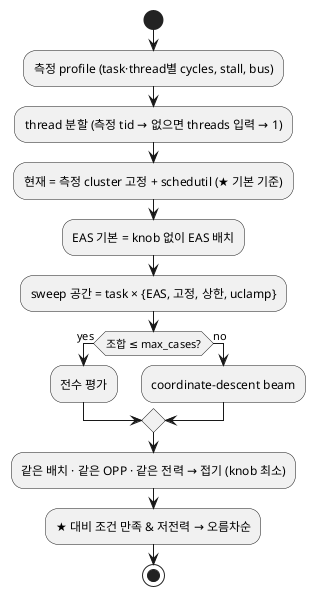

# CPU topology · CPU profile import 가이드

사내 perfetto / simpleperf / profiler 출력 형식이 도구·버전마다 달라서, **파서 코드 대신 `meta.yaml` 설정으로 컬럼·카운터 이름을 매핑**한다. 새 형식이 오면 코드 수정 없이 `pmu.table.sources`만 추가/수정한다.

## 1. SoC CPU topology (`power_model_params.cpu`)

cluster 수·구성은 SoC마다 다르므로 데이터로 둔다. 예시: `examples/cpu-topology/pmp-exynos2{6,7,8}00-cpu-example.yaml` (구성은 실제, 수치는 SYNTHETIC). 사외 개발·테스트는 Exynos2600 예시만 사용하고, 2700/2800 예시는 사내 작성용 템플릿으로 두며 사외에서는 수정하지 않는다 (사내에서 실측 기반으로 수정).

| 필드 | 의미 |
|---|---|
| `clusters[].name` | cluster 이름. 실측 `cpu_breakdown`(rail rollup) cluster 이름과 같게 두면 예측↔실측 `power.cluster`가 join된다 |
| `core_type` | 마이크로아키텍처 id (과제 간 재사용 키, 예: MID_LF / MID_HF / BIG_LF / BIG) |
| `cores`, `cpus` | core 수, trace의 logical CPU id (cpus 개수 = cores) |
| `opps[]` | `{mhz, mv, mw_per_core}` — core 1개 100% util 동적 전력(EM table). 없으면 `coeff_uw_per_mhz_v2` |
| `leakage` | `mw_per_core_at_ref × (V/ref_mv)^exponent` |
| `rail` | 측정 rail 이름 (vdd_power 키로 사용) |
| `ipc_rel` | core type 간 상대 IPC (scheduler capacity, 다른 cluster로 옮길 때 시간 환산) |
| `dsu` | DSU OPP/leakage/rail |
| `scheduler` | what-if용 scheduler 근사 (§5). 없으면 Linux EAS + schedutil 기본값 |

SoC별 구성 (사내 기준, topology 작성 참고):
- Exynos2600: DSU, MID_LF×3, MID_LF×3, MID_HF×3, BIG×1
- Exynos2700: DSU, MID_LF×4, MID_HF×4, BIG_LF×1, BIG×1
- Exynos2800: DSU, MID_HF×3, MID_HF×3, BIG_LF×2, BIG×1

## 2. CPU profile import (`pmu.format: table`)

예시 번들 (사외 기준 Exynos2600): `examples/measurement-import/cpu-profile-sample-e2600/` (simpleperf-like per-thread counter dump + tid, perfetto SQL export 형태의 freq/idle residency). `cpu-profile-sample/`(Exynos2700, thread 정보 없음)은 사내 템플릿으로 유지.

```yaml
pmu:
  format: table
  window: {duration_s: 30, fps: 30}     # 또는 {frames: 900} → counter를 frame당 값으로 정규화
  cpu_map: {"0-2": MID_LF0, "3-5": MID_LF1, "6-8": MID_HF, "9": BIG}   # Exynos2600, 없으면 perfetto.cpu_to_cluster
  table:
    sources: [...]
```

### source 공통
| 키 | 설명 |
|---|---|
| `file` | meta.yaml 기준 상대 경로 |
| `kind` | `counters` / `freq_residency` / `idle_residency` |
| `delimiter` | 생략 시 자동 판별 (`,` `\t` `;` `|`) |
| `header_contains` | 앞부분 설명 텍스트를 건너뛰고, 이 이름의 컬럼이 있는 줄을 header로 사용 |
| `columns` | header 없는 파일의 컬럼 이름 |
| `comment_prefix` | 무시할 줄 접두어 (기본 `#`) |
| `filter` | `{컬럼: regex}` 모두 만족하는 행만 사용 |
| `cpu` / `cluster` | 행의 위치 scope. `{column: cpu}`, `{column: x, regex: "cpu(\\d+)"}`, `{value: MID_HF}` |
| `task` + `task_rules` | thread/process 이름 → 논리 task (`{match: regex, task: eis}`), 여러 thread는 합산 |
| `unmapped_task` | `other`(기본, `(other)`로 합산) / `keep`(원래 이름) / `drop`(버림, warning) |
| `thread` | (선택) task 안의 thread 구분 컬럼 (`{column: tid}` 또는 thread 이름). 주면 task별 thread cycle이 남아 §5 scheduler가 task를 실제 thread 수로 나눈다. 같은 이름의 worker pool이면 tid를 쓴다 |

숫자의 천단위 `,`와 `%`는 허용한다.

### kind별
- `counters`
  - `layout: long`: 행마다 counter 1개 → `counter_column`, `value_column`
  - `layout: wide`: counter가 컬럼 → `counters`의 alias가 컬럼 이름
  - `counters`: 표준 이름 → 도구 이름 목록. 표준: `cycles`, `instructions`, `stall_cycles`, `bus_access`(× `bytes_per_access`), `bus_bytes`
- `freq_residency`: `freq_column`, `freq_unit`(mhz/khz/hz/ghz), `value_column`(시간, 단위 무관)
- `idle_residency`: `state_column`, `value_column`, `states: {regex: active | clock_gated | power_gated}`

### 생성되는 observation (frame당)
| metric | scope |
|---|---|
| `cpu.cycles_pf`, `cpu.instructions_pf`, `cpu.stall_cycles_pf`, `cpu.bus_bytes_pf` | `task_cluster` (`task@cluster`), `cluster` |
| `cpu.thread_cycles_pf` | `task_thread` (`task@cluster#thread`) — `thread` 매핑 시 |
| `cpu.freq_residency` | `cluster_freq` (`cluster@MHz`) |
| `cpu.active_ratio`, `cpu.clock_gated_ratio`, `cpu.power_gated_ratio` | `cluster` |

topology의 `cpu.dsu.name`과 일치하는 cluster 데이터는 DSU로 사용한다(기본 이름 `DSU`). perfetto digest(`perfetto.cpu_to_cluster`)가 만든 `cpu_breakdown[].freq_residency`도 residency가 없는 cluster에 자동 보충된다. 주파수는 유한한 양수, residency는 유한한 음이 아닌 값이어야 하며, 비어 있지 않은 residency의 합은 양수여야 한다.

검증만: `uv run python -m scenario_db.meas_import.cli --meta <meta.yaml> --out <dir> --strict` 후 report의 warning(미매핑 thread/counter/state, cpu_map 누락)을 확인.

## 3. 시뮬레이션에서 사용

```yaml
config:
  power_params_ref: pmp-exynos2600-v1     # cpu topology 포함 (사내: 해당 SoC의 power_model_params)
  cpu_profile_ref: <measurement evidence id>
```

- 측정된 배치 그대로: task×cluster `cycles × Σ r_l·(P_core(f_l)/f_l)` + cluster leakage × `(1 − power_gated_ratio)` + DSU(`active_ratio` 미측정 시 가장 바쁜 cluster의 `1 − cg − pg`).
- mapping되지 않은 cycle은 `(other)`로 남는다(버리지 않음).
- 다른 variant/과제의 profile도 쓸 수 있고(차기 과제 base), 이 경우 warning이 남는다.
- 결과: `power_breakdown.cpu.{by_cluster, by_task, clusters(dynamic/static/mean_mhz/gating), dsu}`, rail은 topology `rail`.

## 4. 고정 배치 what-if (`POST /api/v1/cpu/whatif`, API 전용)

task를 지정 cluster에 고정하고 이상적 DVFS(조건 만족 최소 전력 OPP)로 평가한다. UI(`#/cpu`)는 §5 EAS sweep을 쓴다. 측정 profile의 task별 frame당 수요를 기준으로, 시계열 없이 배치/주파수 조합을 평가한다.

- 시간 모델 (stall 분리): 측정 cluster c0의 평균 주파수 f0 기준
  `core = cycles − stall`, `stall_ms = stall / f0` →
  대상 cluster c, 주파수 f, SW growth g에서 `t = g·core·ipc_rel(c0)/ipc_rel(c)/f + g·stall_ms`.
  core type별 IPC 비율은 topology `ipc_rel`.
- cluster별 OPP: task budget(`budgets_ms`, Timing Budget의 SW budget), `Σt ≤ util_cap × cores × period`, `t ≤ period`를 만족하는 **최소 전력 OPP** (같은 전압의 상위 OPP가 더 유리하면 그것).
- static: `cores × leak(V) × (active + idle × (1 − power_gating_eff))`, DSU는 가장 바쁜 cluster 비율.
- CPU BW: `bus_bytes × g × fps × cpu_bw_scale` (L3/SLC 변경 등은 배율로).
- 결과: 측정 placement(측정 DVFS 그대로 / 이상적 DVFS), 후보 배치별 전력·Δ·최소 slack·CPU BW, power–slack Pareto(★).
- 다른 SoC로 이동: `base_power_params_ref`(측정 SoC topology)를 주면 cluster 이름 → 같은 `core_type` cluster로 대응.

시뮬레이션에서는 profile이 있으면 cluster별 CPU BW가 `cpu.<cluster>`/`BUS` pseudo DMA로 BW 합계·BW power·MIF 비교에 들어간다 (`include_cpu_bw: false`로 끔).

한계(사내 보정 대상): stall 시간의 주파수 무관 가정, core type별 단일 IPC 비율, task는 한 cluster에서 실행.

## 5. EAS + schedutil 재현 · 자동 sweep (`#/cpu`, `POST /api/v1/cpu/sweep`)

Android 기본 가정: **Linux EAS + schedutil**. task가 어디서 도는지는 scheduler가 정하므로, 결과는 "어느 cluster에 둔다"가 아니라 **기기에서 바꿀 수 있는 knob**(cpuset/affinity 고정·상한, uclamp)으로 표현한다.



| 단계 | 모델 |
|---|---|
| util | thread를 frame마다 1회 실행으로 보고 PELT로 환산. `util_est`(기본) = 그 실행의 PELT peak, `pelt_avg` = 평균. 주파수·capacity 불변 (`t·f/fmax`) |
| capacity | `scheduler.capacity`(기기 `/sys/devices/system/cpu/cpuN/cpu_capacity`) 또는 `1024·ipc_rel·fmax / max` |
| 배치 | thread를 util 큰 순으로: 허용 cluster(cpuset) 중 `clamp(util)·fits_margin ≤ cap`, cluster 안에서 여유 capacity가 가장 큰 CPU, cluster 간에는 **동적 전력 증가가 가장 작은 곳** (Linux EM; `energy_includes_static`로 leakage 포함). `prefer_idle` task는 idle CPU 우선. 들어갈 곳이 없으면 overutilized → 여유가 가장 큰 CPU |
| 주파수 | schedutil: `f = 다음 OPP ≥ freq_margin · max_cpu(clamp(Σutil)) / cap · fmax` (stall 때문에 고정점 반복). `deadline_boost`(기본 on): budget이 있는 task는 budget을 맞추는 OPP까지 올림 (ADPF hint / HAL uclamp.min) |
| 전력 | CPU별 `busy/period · P_core(f)` + `leak(V)·(active + idle·(1−pg))`, DSU는 CPU 활동의 합집합 · 측정 residency(없으면 가장 바쁜 cluster의 상대 주파수) |

`power_model_params.cpu.scheduler` (SoC/SW baseline별, 화면 ②의 보정값으로 덮어쓰기 가능):

```yaml
scheduler:
  model: eas
  freq_margin: 1.25          # schedutil (vendor governor면 해당 값)
  fits_margin: 1.25          # fits_capacity
  util_model: util_est       # util_est | pelt_avg
  pelt_halflife_ms: 32       # pelt multiplier: 32 / 16 / 8
  deadline_boost: true
  capacity: {}               # {MID_LF0: 350, ...} sysfs cpu_capacity
  energy_includes_static: false
  task_policy:               # 현재 기기의 cpuset / uclamp / prefer_idle / threads
    post_irta: {prefer_idle: true}
```

화면 구성:
- ③ **Sweep 범위**: cluster 열(core 수 · capacity · OPP 범위), 칸 = fmax에서 task 시간(✓ budget 충족, ⚠ capacity 초과 = EAS가 보내지 않음), 체크 = sweep 포함(기본: budget을 맞출 수 있는 cluster), 파란 칸 = 측정 위치. thread 수·budget·증가 배율을 task별로 입력.
- **모델 확인**: 측정 평균 MHz / active vs 현재 배치의 모델 MHz / util. 차이가 크면 `pelt_halflife_ms`, `freq_margin`, `task_policy`부터 맞춘 뒤 sweep 결과를 본다.
- **후보 목록**: ★(현재 또는 EAS 기본) 대비 조건 만족 & 저전력 순. 행 = knob 요약, 부제 = slack · 바뀐 cluster 주파수 · 동등 변형 수. 클릭하면 적용 방법(cpuset/affinity, uclamp), cluster·CPU 점유(thread 위치), 전력 구성 Δ, task 시간/slack.

사내 적용 순서 (Exynos2700 실측):
1. 실측 export에 `thread: {column: tid}`를 추가해 import → thread 수 확보.
2. topology에 `scheduler.capacity`(sysfs), 기기의 `task_policy`(cpuset/uclamp) 입력.
3. "모델 확인"에서 측정 대비 주파수·util 차이를 `pelt_halflife_ms`/`freq_margin`으로 맞춤.
4. sweep 결과의 knob을 기기에서 적용 → 재측정 → 다시 import 해 비교.

한계: frame 정상상태(시계열·burst 없음), thread는 frame당 1회 실행 가정, CPU 공유 시 대기 시간 미반영(`shared_cpu` 표시), vendor scheduler(EMS 등)의 추가 heuristic 미반영(보정값으로 근사).
