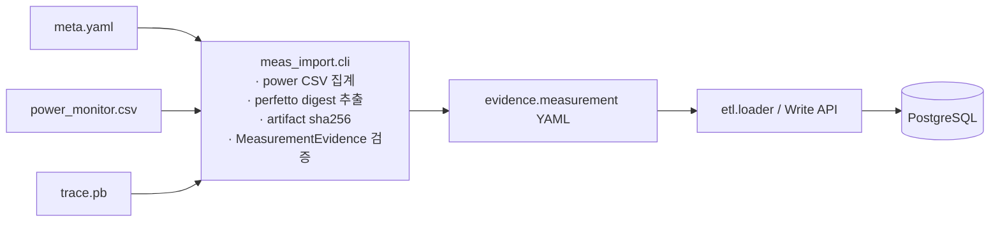

# Measurement Import 가이드 (meas_import)

`scenario_db.meas_import`는 한 번의 측정 캡처(power monitor CSV + perfetto trace)와
`meta.yaml` 사이드카를 입력받아 canonical `evidence.measurement` YAML을 생성한다.
필드 의미와 3-tier 저장 정책은 `docs/contracts/data/measurement-evidence-contract.md`를 따른다.

## 1. 입력 구성

측정 1회분 = 디렉터리 하나:

```text
measurements/uhd30-vdis/
  meta.yaml            # 측정팀이 작성하는 사이드카 (유일한 수기 입력)
  power_monitor.csv    # rail별 전력 waveform
  trace.pb             # perfetto trace (선택, 대용량 — repo에 commit하지 않음)
```

측정팀이 채우는 것은 `meta.yaml`뿐이다. 나머지는 캡처 도구의 원본 산출물이다.

Power/Perfetto 원본 없이 이미 집계된 값을 전달할 때는 `meta.yaml`의
`metric_observations`만으로 canonical measurement YAML을 생성할 수도 있다.

## 2. 데이터 흐름



추출 로직은 raw 원본을 DB에 넣지 않는다. KPI(Tier1)와 digest(Tier2)만 DB로 가고,
원본(Tier3)은 파일 저장소에 두고 `artifacts`에 경로 + sha256만 기록한다.

## 3. 실행

```powershell
cd <SCENARIODB_ROOT>
uv run python -m scenario_db.meas_import.cli `
  --meta demo\measurements\uhd30-vdis\meta.yaml `
  --out generated\measurements `
  --strict
```

산출물:

```text
generated/measurements/
  03_evidence/
    meas-<scenario>-<variant>-<silicon_rev>-<YYYYMMDD>.yaml
  meas_import_report.json
```

플래그:

- `--skip-perfetto` — perfetto 섹션이 있어도 trace digest를 건너뛰고 power-only로 적재.
- `--strict` — error 발생 시 non-zero 종료.
- `--fail-on-warning` — `--strict`와 함께, warning도 실패로 처리.
- `--skip-generated-validation` — 생성 YAML의 MeasurementEvidence 검증 생략(비권장).

생성 후 DB 적재는 contract 문서의 적재 경로(direct ETL)를 따른다:

```powershell
uv run python -m scenario_db.etl.loader generated\measurements\03_evidence --strict --report-json generated\measurements\etl-report.json
```

## 4. meta.yaml 작성

### 4.1 식별/정적 메타

```yaml
schema_version: "2.2"
# id 생략 시 meas-<scenario>-<variant>-<silicon_rev>-<YYYYMMDD>로 자동 생성
project_ref: proj-sm-s947b
scenario_ref: uc-camera-recording
variant_ref: cam-rec-r1-uhd30-vdis
measured_at: "2026-06-10T15:20:00+09:00"   # ISO 8601
execution_context:
  silicon_rev: EVT1
  sw_baseline_ref: sw-vendor-v1.2.3
  thermal: room
  method: measurement                       # 생략 시 measurement로 강제
provenance:
  device_id: "EVT1-ERD-SN-0042"
  ...
```

### 4.2 추출기가 만들지 않는 KPI

frame latency, 유효 fps 등 측정 앱 로그에서 오는 값은 `kpi`로 직접 전달한다.

```yaml
kpi:
  frame_latency_ms: 28.4
  fps_effective: 29.97
```

`total_power_mw`를 `kpi`에 직접 적으면 power CSV 집계값보다 우선한다.

### 4.2.1 확장 metric observation

Rail/DMA port/pipeline stage/SW task처럼 scope가 있는 상세 값은
`metric_observations`에 기록한다. 허용 metric, scope, canonical unit는
`src/scenario_db/models/evidence/metric_catalog.yaml`을 따른다.

```yaml
metric_observations:
  - metric_id: sw.start_jitter
    scope: {kind: task, ref: eis_warp}
    unit: us
    stats: {mean: 84, p95: 210, max: 620, n: 5400}
```

명시 observation과 power/Perfetto에서 파생된 observation의 identity가 같으면
명시 observation이 우선한다. Identity는 `metric_id + scope.kind + scope.ref`다.

### 4.3 Power CSV 매핑 (`power`)

CSV는 time 열 + rail별 전력(mW) 열로 구성된 waveform이다. 각 rail은 캡처 구간 전체에
대해 mean/p95/std/n으로 집계된다(n = CSV 샘플 수).

```yaml
power:
  csv: power_monitor.csv          # meta.yaml 기준 상대경로 또는 절대경로
  time_column: timestamp_ms
  total_power_rails:              # 샘플별로 합산 후 집계 → total_power_mw KPI
    [VDD_CAM, VDD_MIF, VDD_INT, VDD_NPU, VDD_BIG, VDD_MID, VDD_LIT]
  # total_power_column: TOTAL     # 이미 합산된 열이 있으면 이걸 우선 사용
  rails:
    VDD_CAM: {role: vdd}                            # → vdd_power
    VDD_BIG: {role: cpu_cluster, cluster: BIG}      # → cpu_breakdown[BIG].power_mw
    VDD_MID: {role: cpu_cluster, cluster: MID}
    VDD_LIT: {role: cpu_cluster, cluster: LIT}
    # role: ignore — 집계 제외
```

- `role: vdd` → `vdd_power[rail] = {mean_mw, p95_mw}`.
- `role: cpu_cluster` → 같은 cluster의 rail을 **샘플별로 합산**한 뒤 MeasuredKpi로 집계해
  `cpu_breakdown[cluster].power_mw`에 들어간다.
- `total_power_rails`는 지정 rail을 **샘플별 합산** 후 집계한다(통계적으로 올바른 방식).

`format: rail_long`은 반복 측정별 rail voltage/current/power triplet을 받는다.

```yaml
power:
  csv: power_monitor.csv
  format: rail_long
  run_column: run
  rail_column: rail
  voltage_column: voltage_v
  current_column: current_ma
  power_column: power_mw
```

Importer는 power KPI와 기존 `vdd_power` 외에도 rail별 `power.rail`,
`power.rail_voltage`, `power.rail_current` observation을 생성한다.

### 4.4 Perfetto digest (`perfetto`)

```yaml
perfetto:
  trace: trace.pb
  cpu_to_cluster:                 # perfetto CPU index → 논리 cluster
    0: LIT
    7: BIG
  frame_slice_name: "Camera::ProcessFrame"   # count_per_frame 정규화용 frame 수
  # frame_count: 5400             # 명시 지정 시 위 slice count 쿼리를 건너뜀
  task_mapping:
    - task: eis_warp              # 논리 task 이름 (raw thread name 아님)
      cluster: BIG
      match: {process: "vendor.camera.provider", thread_re: "VDIS.*"}
    - task: encoder_input_feed
      match: {process: "mediaserver", slice_re: "encodeFrame"}
```

추출 결과:

- `cpu_to_cluster` → cluster별 `freq_residency`(시간 가중) + `avg_freq_mhz` →
  `cpu_breakdown`에 병합.
- `task_mapping` → 매칭된 slice duration을 task별 mean/p50/p95/max/samples로 롤업하고,
  frame 수가 있으면 `count_per_frame`을 계산 → `sw_task_timing`.

`match`는 `process`/`process_re`/`thread`/`thread_re`/`slice_re` 중 하나 이상.
`*_re`는 정규식(부분 일치). **논리 task 이름은 프로젝트 간 SW projection의 join 키**이므로
U/V에서 같은 기능에 같은 이름을 써야 한다(contract 문서 §2 task naming 규약).

### 4.4.1 PMU digest (`pmu`)

PMU/perfetto 리포트의 사내 포맷이 확정되기 전까지는 **중립 sample 포맷**을 입력으로 받는다
(리포트별 adapter는 이 포맷의 행만 만들면 된다). 예: `examples/measurement-import/pmu-sample/`.

```yaml
pmu:
  file: pmu_digest.csv          # 또는 .json ({"format": "scenariodb.pmu_digest", "samples": [...]})
  ip_map: {MCSC: ip-mcsc-is-v15-s5e9975}    # PMU 이름 → catalog id (simulation evidence와 join)
  cluster_map: {big: BIG}
```

CSV 열: `metric,scope_kind,scope_ref,value,unit,stat,freq_mhz` (`#` 주석 허용).

| `metric` | scope_kind | 생성 observation | 단위 |
| --- | --- | --- | --- |
| `ip_clock_mhz` | ip | `clock.ip` stats, `stat=dominant`는 `clock.ip_dominant` | MHz (GHz/kHz/Hz 환산) |
| `ip_clock_residency` | ip | 주파수별 시간(`freq_mhz` 필수)에서 가중평균/중앙값/min/max/dominant 계산 | 비율만 사용 |
| `mem_bw_read_mbs`, `mem_bw_write_mbs` | mif, dram | `bandwidth.mem_read`, `bandwidth.mem_write` | MB/s (GB/s 환산) |
| `cpu_cycles`, `cpu_instructions` | cluster | `cpu.cycles`, `cpu.instructions` (value) | count |
| `cpu_ipc` | cluster | `cpu.ipc` (없으면 instructions/cycles 파생) | ipc |

- `stat`: `mean|weighted_mean|p50|p95|p99|min|max|std|dominant`(clock/BW), `sum|value`(counter).
- 명시 clock 행은 residency 파생값보다 우선한다. 알 수 없는 metric은 warning 후 건너뛰고,
  형식/단위/scope 오류와 중복은 `pmu_digest_invalid` import error다.
- 예측 쪽은 `dvfs_breakdown`(IP별 set clock, 인스턴스 최대)과 `dma_breakdown`(read/write 합 →
  `mif/total`)에서 같은 identity로 생성되어 비교 화면에서 정렬된다. 측정 BW는 CPU/GPU 등
  전체 master를 포함하므로 delta는 IP DMA 밖 트래픽이다. CPU counter는 예측 쪽이 없어
  `MEASUREMENT_ONLY`로 남는다.
- 검사만: `uv run python -m scenario_db.meas_import.pmu_digest <file> --ip-map MCSC=ip-...`
- 측정 clock 사용: 시뮬레이션 요청 `config: {clock_basis: measured, measured_clock_ref: <meas id>}`
  (Clock Ledger, `docs/contracts/simulation/soc-simulation-contract.md`).

### 4.5 Artifacts

```yaml
artifacts:
  - type: perfetto_trace
    storage: fileshare
    path: "artifacts/proj-sm-s947b/uc-camera-recording/cam-rec-r1-uhd30-vdis/20260610-sw123/trace.pb"
    source: trace.pb              # sha256 계산용 로컬 파일 (생략 시 path 사용)
    mime: application/octet-stream
```

`source` 파일이 존재하면 sha256/bytes를 계산해 기록하고, 없으면 포인터만 남기고
warning을 낸다(원본이 파일 저장소에만 있고 변환 머신에 없는 경우가 정상).

## 4.6 갱신 (revision)

같은 `id`의 evidence는 같은 측정이다. 값을 정정하려면 meta.yaml을 고치고 `provenance.revision`을 올린다.

```yaml
id: meas-...-evt0          # 고정 (정정해도 바뀌지 않음)
provenance:
  revision: 2              # 1 → 2
```

- `meas_import.cli`: 출력 파일이 이미 있고 내용이 다르면 revision이 더 클 때만 덮어쓴다 (아니면 `evidence_revision_conflict`).
- ETL: SW timing / profiling이 들어간 evidence(`import_fingerprint`)는 revision이 더 큰 문서로만 교체된다.
  이 evidence로 만든 timing profile은 hash가 달라져 simulation 재생 시 `source hash mismatch`로 막힌다 (재생성 필요).
- 과제 DB 폴더 단위 일괄 처리: `scripts/import_measurements.py <db 폴더>` (예: `db_Exynos2700_SM-S957B`).

## 5. perfetto 의존성

`perfetto` 패키지는 선택 의존성이며 lazy import된다.

- 설치되어 있고 trace 파일이 존재하면 trace_processor로 digest를 추출한다.
- 패키지가 없으면 `perfetto_unavailable` warning을 내고 power-only로 진행한다.
- trace 파일이 없으면 `perfetto_trace_not_found` warning 후 진행한다.

추출 로직(residency 정규화, percentile 롤업, task 매핑)은 `TraceQuery` 프로토콜에만
의존하므로 실제 binary 없이 단위 테스트된다(`tests/unit/meas_import/test_perfetto_digest.py`).
SQL은 `perfetto_digest.py` 상단 상수로 분리되어 trace config에 맞춰 검토/수정 가능하다.

## 6. 통계 의미

- 한 번의 캡처(단일 CSV) 내 시간 샘플들에 대한 mean/p95/std/n이다. `n`은 CSV 샘플 수.
- 반복 측정 회수는 `provenance.sample_count`로 별도 기록한다(현재 v1은 캡처당 CSV 1개).
- `ci_95`는 n>1이고 std>0일 때 정규근사 신뢰구간으로 계산된다.

## 7. 다음 단계와의 연결

- compare/추이 뷰: `/api/v1/evidence?kind=evidence.measurement&project_ref=...`로 조회,
  `/compare/*`로 sim vs meas / sw 버전별 비교(contract 문서 §6).
- U→V projection(Phase 5): U 측정으로 sim 보정 오차를 산출한 뒤 V projected evidence를
  `derived_from` lineage와 함께 생성한다.
