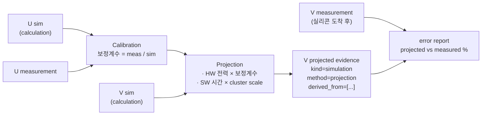

# Cross-Project Projection 가이드 (projection)

`scenario_db.projection`은 한 과제(U)의 **실측 vs 계산(sim) 보정 오차**를 산출해, 다른
과제(V)의 계산 기반 sim을 측정값에 가까운 **예측(projection) evidence**로 변환한다.
필드/lineage 규약은 `docs/contracts/data/measurement-evidence-contract.md` §3을 따른다.

## 1. 핵심 개념



**U 실측의 첫 용도는 projection이 아니라 캘리브레이션이다.** U에서 sim이 실측을 얼마나
잘 맞추는지(보정계수)를 정량화한 뒤에야 V 예측의 신뢰 근거가 생긴다.

## 2. 캘리브레이션 대상

sim과 meas가 **같은 의미로 노출하는 지표만** 보정한다.

| 지표 | sim | meas | 보정계수 |
| --- | --- | --- | --- |
| `kpi.total_power_mw` | flat number | MeasuredKpi.mean | meas/sim |
| 겹치는 `kpi.*` 수치 | flat | flat or MeasuredKpi | meas/sim |
| `vdd_power[rail]` | rail 전력 | rail 전력 | rail별 meas/sim |

CPU cluster 전력(meas)과 per-IP 전력(sim)은 1:1 대응이 안 되므로 직접 보정하지 않는다.
`ip_breakdown`은 global total-power 계수로 **균일 스케일**한다(근사, trace에 기록).

## 3. SW 시간 projection

U의 실측 `sw_task_timing`을 cluster별 `time_scale`로 스케일한다(작업량 고정, 시간 ∝ 1/capacity).

```text
V_task_time = U_task_time × time_scale[cluster]
time_scale = u_capacity_mhz / v_capacity_mhz   (또는 직접 지정)
```

`count_per_frame`, `samples`는 주파수와 무관하므로 스케일하지 않는다. 논리 task 이름이
U/V에서 동일해야 매칭된다(contract §2 task naming 규약).

## 4. 실행

```powershell
cd <SCENARIODB_ROOT>
uv run python -m scenario_db.projection.cli `
  --recipe demo\projection\uhd30-vdis-u-to-v.yaml `
  --out generated\projection `
  --strict
```

산출물:

```text
generated/projection/
  03_evidence/
    sim-<scenario>-<variant>-<silicon_rev>-projection.yaml
  projection_report.json
```

실리콘 도착 후 검증(loop close):

```powershell
uv run python -m scenario_db.projection.cli `
  --recipe demo\projection\uhd30-vdis-u-to-v.yaml `
  --out generated\projection `
  --verify path\to\v-measurement.yaml
```

`--verify`는 projected vs measured %오차를 계산해 evidence의
`calculation_trace.projection.error_report`에 기록한다.

## 5. Recipe 작성

```yaml
kind: projection.recipe
sources:                          # recipe 기준 상대경로
  u_measurement: u-meas.yaml      # U 실측 evidence
  u_simulation: u-sim.yaml        # U 계산 evidence (U meas와 같은 variant)
  v_simulation: v-sim.yaml        # 스케일 대상 V 계산 evidence
target:
  project_ref: proj-v-nextgen
  scenario_ref: uc-camera-recording-v
  variant_ref: cam-rec-uhd30-vdis
  silicon_rev: PRE_SI
  sw_baseline_ref: sw-vendor-v1.3.0
  # id 생략 시 sim-<scenario>-<variant>-<silicon_rev>-projection 자동 생성
cluster_scaling:
  BIG: {u_capacity_mhz: 3000, v_capacity_mhz: 3750}   # -> time_scale 0.8
  MID: {time_scale: 0.85}
scale_ip_breakdown: true
notes: "가정/근거 메모"
```

> 현재 sources는 **파일 경로**다. canonical evidence YAML(meas_import / sim 산출물)을
> 그대로 입력한다. DB의 evidence id를 canonical key로 자동 해석하는 경로는 후속 작업이다.

## 6. 출력 evidence 구조

- `kind: evidence.simulation`, `execution_context.method: projection`.
- `derived_from`: `[u_measurement_id, u_simulation_id, v_simulation_id]` — lineage 필수.
- `kpi`, `vdd_power`, `ip_breakdown`: 보정계수로 스케일된 HW 전력.
- `sw_task_timing`: U 실측을 cluster scale로 변환한 SW 시간(예측 sim이 SW 시간을
  담도록 SimulationEvidence에 `sw_task_timing` 필드를 추가했다).
- `calculation_trace.projection`: 보정계수 detail, 스케일된 항목, cluster_scaling,
  (verify 시) error_report까지 전부 기록 — projection은 항상 감사 가능해야 한다.

lineage 없는 projection은 review gate에서 신뢰 불가 데이터로 취급한다(contract §3).

## 7. 한계와 가정 (v1)

- 보정은 aggregate(total + rail) 수준. per-IP는 균일 스케일 근사.
- SW 시간 스케일은 compute-bound + 동일 IPC 가정. memory-bound 보정, IPC 차이,
  freq residency 가중은 오차를 본 뒤 정교화한다.
- sources는 파일 경로. canonical key 기반 DB 조회는 후속.
